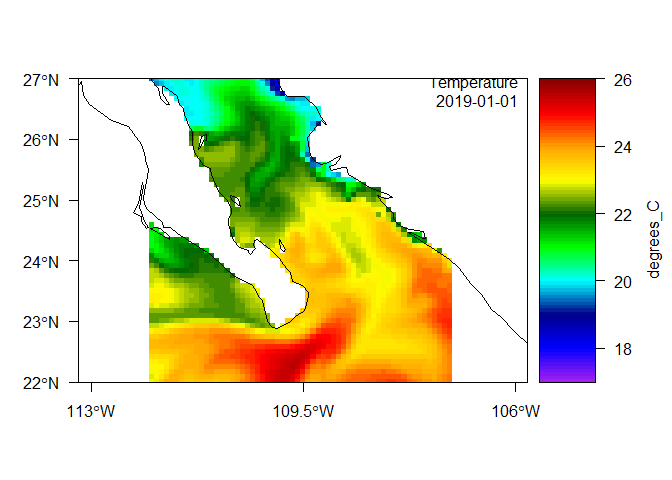

Datos temporales en R.
================
Héctor Villalobos

# Introducción

Para trabajar con datos temporales en R es importante conocer las
diferentes clases disponibles para almacenar y representar esta
información. Para ello, primeramente debemos saber como están
estructurados los datos fuente.

Es muy común que en los archivos (ascii o excel) en los que tenemos o
nos facilitan información se intercambie de posición el mes y el día en
diferentes renglones ¡de la misma columna!, por lo que es sumamente
importante verificar esto antes de importarlos en R, de lo contrario se
obtendrán resultados inconsistentes. Por ello es importante adoptar un
estilo consistente. Los mas apropiados son “dd-mm-yyyy” y “yyyy-mm-dd”
donde cada letra representa un dígito para el día (“D”), mes (“M”) y año
(“Y”).


Cuando nuestros datos incluyen horas, quedarían como “dd-mm-yyyy
HH:MM:SS” y “yyyy-mm-dd HH:MM:SS”. Cuando datos de este tipo se importan
desde un archivo ascii con la función `read.table()`, en R serán de
clase “character”, lo cual dificultará su uso en gráficos o para
realizar operaciones, por lo que debemos convertirlos a una clase
especial para fechas o fecha-tiempo. Tal vez la clase más sencilla,
cuando solo tenemos la fecha es “Date”.

``` r
fechas <- paste("2024", c("09", "10", "11", "12"), c("13", "18", "25", "31"), sep ="-")
fechas
```

    [1] "2024-09-13" "2024-10-18" "2024-11-25" "2024-12-31"

``` r
class(fechas)
```

    [1] "character"

Como vemos, en este momento son clase “character”. La conversión a la
clase “Date” se logra con la función `as.Date().`

``` r
fechas <- as.Date(fechas)
fechas
```

    [1] "2024-09-13" "2024-10-18" "2024-11-25" "2024-12-31"

``` r
class(fechas)
```

    [1] "Date"

Esta clase representa el número de días desde el 1 de enero de 1970.

``` r
unclass(fechas)
```

    [1] 19979 20014 20052 20088

``` r
origen <- as.Date("1970-01-01")
```

``` r
fechas - origen
```

    Time differences in days
    [1] 19979 20014 20052 20088

Con la función `Sys.time()` podemos obtener la fecha-hora actual en el
“locale” de nuestra computadora, y al aplicar la función `as.Date()` la
hora se descarta.

``` r
ahora <- Sys.time()
ahora
```

    [1] "2024-10-08 19:20:13 MST"

``` r
as.Date(ahora)
```

    [1] "2024-10-09"

Esto nos lleva a las siguientes clases que permiten guardar la hora y la
zona de tiempo: **POSIXlt** y **POSIXct**. La primera es una lista de
vectores `sec`, `min`, `hour` para el tiempo y `mday`, `mon` y `year`
para la fecha. `wday` y `yday` para el día de la semana y el día del
año. `isdst`, es una bandera para el horario de verano, y algunas veces
`zone`, una cadena de texto para la zona de tiempo y `gmtoff`, que sería
el *offset* en segundos del horario GMT. La función `strptime()` nos
permite convertir una cadena de texto a la clase POSIXlt.

``` r
dt <- strptime("2024-10-08 14:12:30", format = "%Y-%m-%d %H:%M:%S", tz = "UTC")
dt
```

    [1] "2024-10-08 14:12:30 UTC"

``` r
class(dt)
```

    [1] "POSIXlt" "POSIXt" 

Pare ver los vectores anteriores, usamos la función `unclass()` como
antes.

``` r
unclass(dt)
```

    $sec
    [1] 30

    $min
    [1] 12

    $hour
    [1] 14

    $mday
    [1] 8

    $mon
    [1] 9

    $year
    [1] 124

    $wday
    [1] 2

    $yday
    [1] 281

    $isdst
    [1] 0

    $zone
    [1] "UTC"

    $gmtoff
    [1] 0

    attr(,"tzone")
    [1] "UTC"
    attr(,"balanced")
    [1] TRUE

También podemos usar la función `as.POSIXlt()` con el mismo propósito, y
si no indicamos la zona se ajustará a la de nuestra configuración

``` r
X1 <- as.POSIXlt("2024-10-08 14:12:30")
X1
```

    [1] "2024-10-08 14:12:30 MST"

``` r
class(X1)
```

    [1] "POSIXlt" "POSIXt" 

La siguiente clase, POSIXct, representa el número de segundos desde el
inicio de 1970 (en UTC) como un vector numérico.

``` r
X2 <- as.POSIXct("2024-10-08 14:12:30")
X2
```

    [1] "2024-10-08 14:12:30 MST"

``` r
class(X2)
```

    [1] "POSIXct" "POSIXt" 

hdhdhgd

``` r
unclass(X2)
```

    [1] 1728421950
    attr(,"tzone")
    [1] ""

``` r
# definir origen
orig <- as.POSIXct("1970-01-01 00:00:00", format = "%Y-%m-%d %H:%M:%S", tz = "UTC") 

# calcular la diferencia entre X2 y el origen
difftime(X2, orig, units = "s")
```

    Time difference of 1728421950 secs

Datos diarios de temperatura

``` r
# cargar paquete devtools
#library(devtools)

# instalar 'satin' desde github
#install_github("hvillalo/satin")

# cargar paquete satin
library(satin)
```

Importar datos de Copernicus

``` r
cop <- read.cmems("./datos/cmems_mod_glo_phy_my_0.083deg_P1D-m_1728438763697.nc")
```

inspeccionar objeto cop

``` r
class(cop)
```

    [1] "list"

``` r
names(cop)
```

    [1] "so"     "thetao"

usaremos solo la temperatura potencial, thetao

``` r
thetao <- cop$thetao
thetao
```

    Object of class satin

     Title: thetao 
     Long name: Temperature 
     Name: thetao 
     Units: degrees_C 
     Temporal range: daily 
     Spatial resolution: 9.2 km 

    Data dimensions:
     121 120 731 5 

    Data ranges:
              lon lat   thetao     period    depth
    min -117.0000  22 11.43721 2019-01-01 0.494025
    max -107.0833  32 33.36512 2020-12-31 5.078224

En este tenemos 731 días , del 2019-01-01 al 2020-12-31

``` r
head(thetao@period$tmStart); tail(thetao@period$tmStart)
```

    [1] "2019-01-01 UTC" "2019-01-02 UTC" "2019-01-03 UTC" "2019-01-04 UTC"
    [5] "2019-01-05 UTC" "2019-01-06 UTC"

    [1] "2020-12-26 UTC" "2020-12-27 UTC" "2020-12-28 UTC" "2020-12-29 UTC"
    [5] "2020-12-30 UTC" "2020-12-31 UTC"

Haremos un mapa para elegir un punto y extraer los valores de
temperatura en el nivel más superficial

``` r
plot(thetao)
```



Tomemos por ejemplo un pixel a los 26° de lat N y 110° de lon W

``` r
pt <- data.frame(x = -110, y = 26)
sst <- extractPts(thetao, points = pt)
dim(sst)
```

    [1]    1 3661

En sst están los valores de temperatura potencial para el punto
seleccionado, en los 731 díasy para los 5 niveles de profundidad 731
$\times$ 5 = 3655. Las primeras seis columnas adicionales en sst
contienen el id del punto o puntos elegidos, las coordenadas de
latitud-longitud elegidas, las coordenadas del pixel más cercano donde
hay datos y la distancia entres el punto elegido y el dato devuelto,
solo como un control

``` r
sst[ , 1:10]
```

      id    x  y d  lon lat       p1      p2       p3       p4
    1  1 -110 26 0 -110  26 21.68557 21.6072 21.40651 21.27906

Para repesentar la serie de tiempo podemos rearreglar nuestros datos
extraidos de la siguiente manera

``` r
fecha <- thetao@period$tmStart
tsm <- data.frame(fecha, temperatura = t(sst[ , 7:(731+6)]))
head(tsm)
```

            fecha temperatura
    p1 2019-01-01    21.68557
    p2 2019-01-02    21.60720
    p3 2019-01-03    21.40651
    p4 2019-01-04    21.27906
    p5 2019-01-05    21.27906
    p6 2019-01-06    21.24976

Figura

``` r
plot(tsm, type = "b", pch = 16, col = rgb(1, 0, 0, 0.2))
```


Si quisieramos los promedios mensuales

``` r
library(lubridate)
```


    Attaching package: 'lubridate'

    The following objects are masked from 'package:base':

        date, intersect, setdiff, union

``` r
tsm$mes <- month(tsm$fecha)
tsm$año <- year(tsm$fecha)
head(tsm)
```

            fecha temperatura mes  año
    p1 2019-01-01    21.68557   1 2019
    p2 2019-01-02    21.60720   1 2019
    p3 2019-01-03    21.40651   1 2019
    p4 2019-01-04    21.27906   1 2019
    p5 2019-01-05    21.27906   1 2019
    p6 2019-01-06    21.24976   1 2019

Suavizado con promedios móviles

``` r
library(smooth)
```

    Loading required package: greybox

    Package "greybox", v2.0.1 loaded.


    Attaching package: 'greybox'

    The following object is masked from 'package:lubridate':

        hm

    This is package "smooth", v4.0.2

``` r
sm <- cma(tsm$temperatura, order = 30)
tsm$sm <- sm$fitted

plot(tsm$fecha, tsm$temperatura, type = "b", pch = 16, col = rgb(1, 0, 0, 0.2),
     xlab = "día", ylab = "temperatura")
lines(tsm$fecha, tsm$sm, lwd = 2)
```


Agregar por año mes

``` r
tsm.mens <- aggregate(tsm$temperatura, by = list(mes = tsm$mes, año = tsm$año), mean)
head(tsm.mens)
```

      mes  año        x
    1   1 2019 21.36710
    2   2 2019 19.60258
    3   3 2019 20.55122
    4   4 2019 21.91614
    5   5 2019 24.13084
    6   6 2019 26.40666

``` r
plot(as.Date(paste(tsm.mens$año, tsm.mens$mes, 15, sep = "-")), tsm.mens$x,
     xlab = "mes", ylab = "temperatura (°C)", type = "b")
```


  
