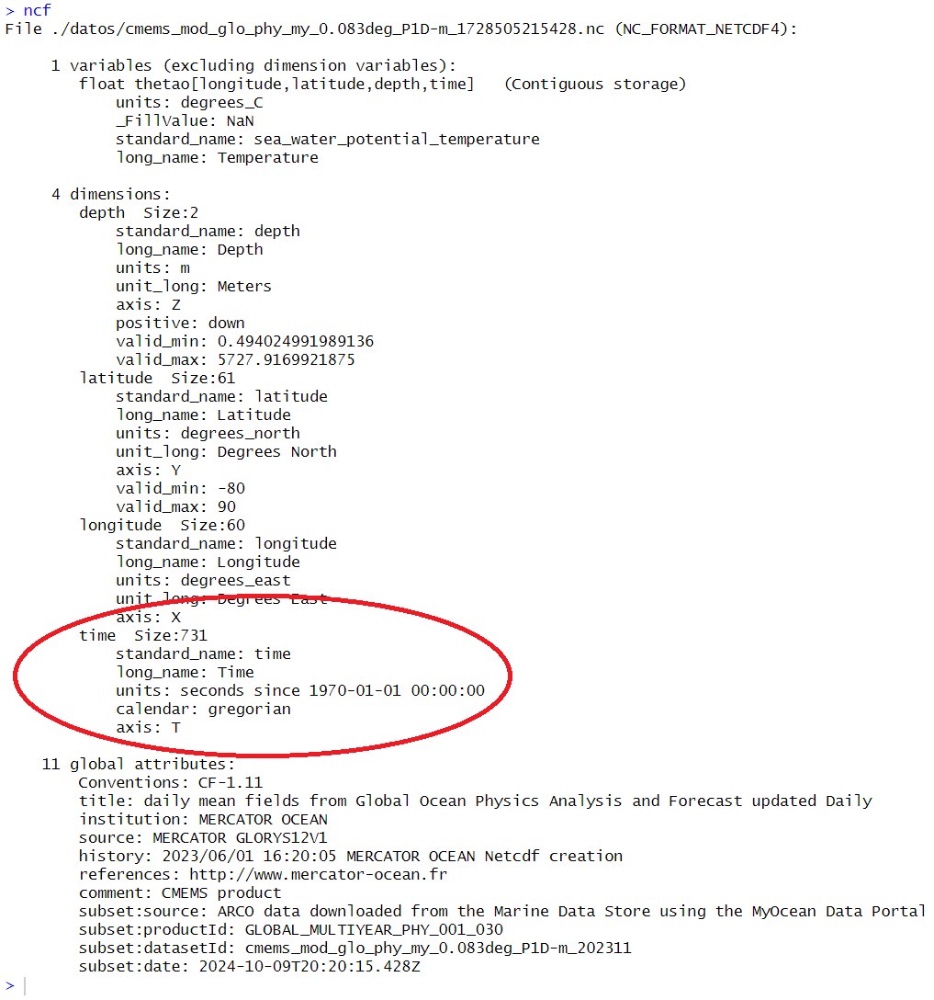
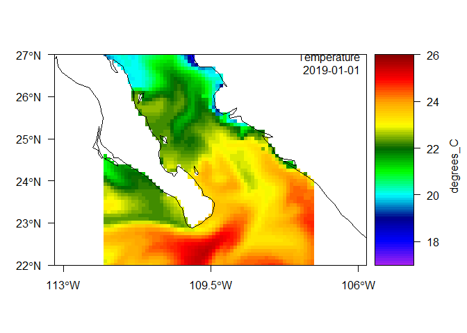
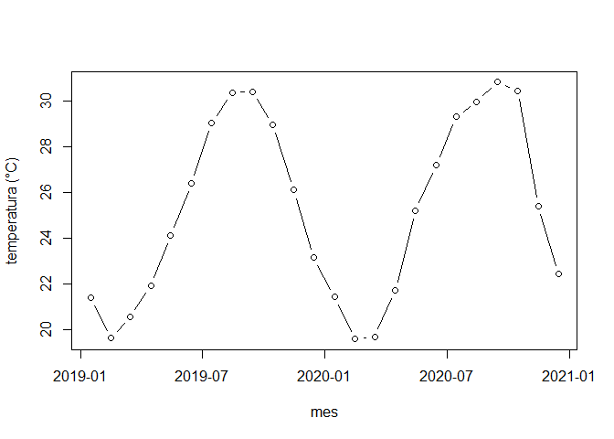
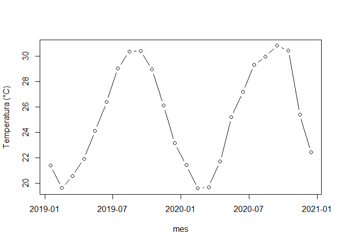
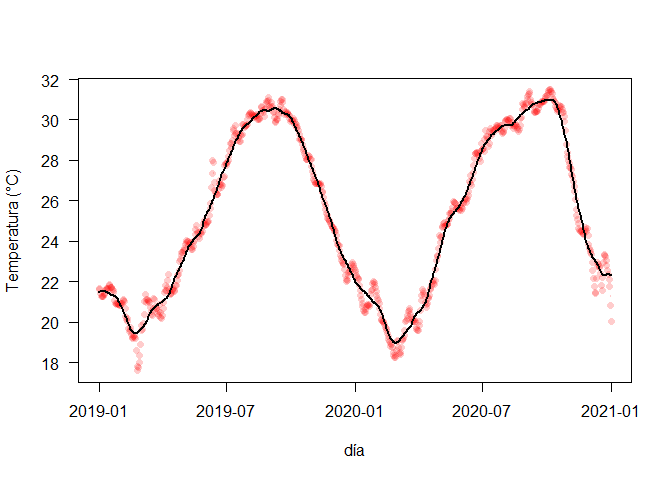
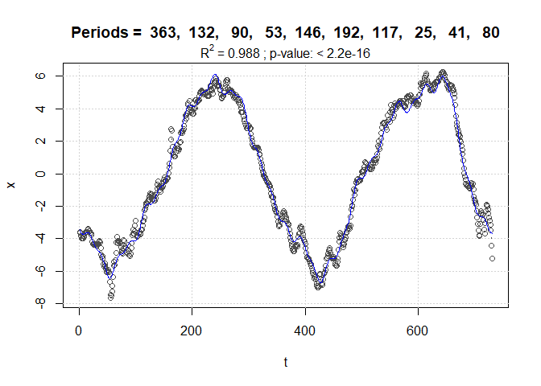
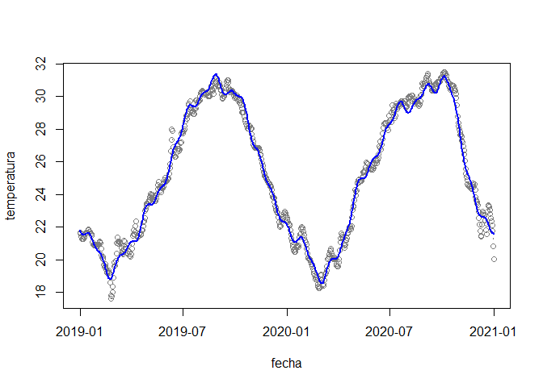

Datos temporales en R
================
Héctor Villalobos

## Introducción

Hablamos de datos temporales cuando las variables que se recolectan
tienen asociada una fecha y posiblemente una hora. El uso correcto de
estos datos depende de definir con toda claridad el formato en que esta
información se almacena. Por ejemplo, en nuestros archivos (ascii o
Excel) se puede guardar el año, mes y día en columnas separadas, o
combinados en una misma columna como una cadena de texto o bien en un
formato especializado de fecha (en el caso de Excel).

Usualmente se utilizan solo números, dos dígitos para el mes y el día y
cuatro para el año, por lo que tendríamos algo así como “30-09-2024”
(dd-mm-aaaa), aunque no necesariamente en ese orden. En otros casos
podría escribirse el nombre del mes completo o abreviado, por ejemplo
“2024/Sep/30” (aaaa/mmm/dd). El tiempo podría estar en una columna
aparte o también combinado con la fecha: “2024-09-30 15:30:58”
(aaaa-mm-dd hh:mm:ss).

Lo importante en todos los casos es la consistencia, no mezclar los
nombres de los meses con números, ni escribir indistintamente “Sep”,
“sep” y “Septiembre”, pero sobre todo, no invertir el orden del mes y el
día. Es indisoensable revisar estos detalles en nuestros datos antes de
importarlos en R.


Al importar en R desde archivos ascii con la función `read.table()`, la
variable con la fecha será reconocida como texto (clase `"character"`),
lo cual dificultará su uso en gráficos o para realizar operaciones, por
lo que debemos convertirlos a una clase apropiada. En cambio, al
importar archivos Excel con la función `read_excel()` del paquete
**readxl** usualmente ya pasan como clase `"POSIXct"`, si el formato no
es ambiguo. A continuación se describen algunas de estas clases
especializadas.

## Clase `"Date"`

Esta es tal vez la clase más sencilla cuando solo tenemos fechas.

``` r
fechas <- paste("2024", c("09", "10", "11", "12"), c("13", "18", "25", "31"), sep ="-")
fechas
```

    [1] "2024-09-13" "2024-10-18" "2024-11-25" "2024-12-31"

En el ejemplo, el vector `fechas`, aunque parece contener fechas, es de
clase `"character"`.

``` r
class(fechas)
```

    [1] "character"

La conversión a la clase `"Date"` se logra con la función `as.Date()`.
Esta función trata de determinar que parte de la cadena de texto
representa al día, al mes y al año, al igual que el carácter que separa
a cada elemento (en este caso “-”), aunque de igual manera podemos
especificarlo nosotros mediante el argumento `format = "%Y-%m-%d"` que
explicaremos más adelante.

``` r
fechas <- as.Date(fechas)
fechas
```

    [1] "2024-09-13" "2024-10-18" "2024-11-25" "2024-12-31"

``` r
class(fechas)
```

    [1] "Date"

Esta clase se almacena como el número de días desde el 1 de enero de
1970.

``` r
unclass(fechas)
```

    [1] 19979 20014 20052 20088

Podemos verificar lo anterior definiendo el origen en la misma clase y
restandolo a nuestro vector de fechas.

``` r
origen <- as.Date("1970-01-01")
fechas - origen
```

    Time differences in days
    [1] 19979 20014 20052 20088

Con la función `Sys.time()` podemos obtener la fecha-hora actual de
acuerdo a la configuración local de nuestra computadora.

``` r
ahora <- Sys.time()
ahora
```

    [1] "2024-10-16 12:40:12 MST"

La función `as.Date()` descarta la hora. Aquí se especifica la zona de
tiempo de la configuración local de la computadora donde se creó este
tutorial para evitar que se considere con horario UTC (tiempo universal
coordinado, sucesor del tiempo medio de Greenwich o GMT) . Se pueden
consultar los códigos de las zonas de tiempo con la función
`OlsonNames()`.

``` r
as.Date(ahora, tz = "America/Mazatlan")
```

    [1] "2024-10-16"

## La clase `"POSIXlt"`

Las clases más utilizadas en R que permiten guardar la fecha, hora y la
zona de tiempo son **“POSIXlt”** y **“POSIXct”**. La primera almacena
esta información como una lista de vectores `sec`, `min`, `hour` para el
tiempo; `mday`, `mon` y `year` para la fecha; `wday` y `yday` para el
día de la semana y el día del año, respectivamente;`isdst`, es una
bandera para el horario de verano; `zone` es una cadena de texto para la
zona de tiempo; y `gmtoff` sería el *offset* en segundos del horario
GMT. La función `strptime()` nos permite convertir una cadena de texto a
la clase `"POSIXlt"`.

``` r
dt <- strptime("2024-10-17 07:12:30", format = "%Y-%m-%d %H:%M:%S", tz = "UTC")
dt
```

    [1] "2024-10-17 07:12:30 UTC"

``` r
class(dt)
```

    [1] "POSIXlt" "POSIXt" 

Aquí vemos de nueva cuenta el uso del argumento `format` indicando que
el año está primero e incluye la centuria (`%Y`), seguido del mes como
número de dos dígitos (`%m`) y el día (`%d`) separados por un guión.
Después siguen los códigos para la hora (`%H`), minutos (`%M`) y
segundos (`%S`) separados por “:”. Si nuestra cadena de texto hubiera
sido “24-Oct.-17” el argumento cambiaría a `format = "%y-%b-%d"`. Estos
códigos y otros más se pueden consultar en la ayuda de la función
`strptime()`.

Para ver los vectores mencionados antes, usamos nuevamente la función
`unclass()`.

``` r
unclass(dt)
```

    $sec
    [1] 30

    $min
    [1] 12

    $hour
    [1] 7

    $mday
    [1] 17

    $mon
    [1] 9

    $year
    [1] 124

    $wday
    [1] 4

    $yday
    [1] 290

    $isdst
    [1] 0

    $zone
    [1] "UTC"

    $gmtoff
    [1] 0

    attr(,"tzone")
    [1] "UTC"
    attr(,"balanced")
    [1] TRUE

Notar que el mes es 9 porque se cuenta desde 0. En el caso del año, el
origen es 1900, por lo que 124 + 1900 = 2024.

También podemos usar la función `as.POSIXlt()` para convertir una cadena
de texto a la clase `"POSIXlt"`. En este caso, si no lo indicamos la
zona de tiempo se ajustará de acuerdo a nuestra configuración local.

``` r
psx.lt <- as.POSIXlt("2024-10-17 07:12:30")
psx.lt
```

    [1] "2024-10-17 07:12:30 MST"

``` r
class(psx.lt)
```

    [1] "POSIXlt" "POSIXt" 

## La clase `"POSIXct"`

Esta clase representa el número de segundos desde el primero de enero de
1970 (en UTC) como un vector numérico.

``` r
psx.ct <- as.POSIXct("2024-10-17 07:12:30", tz = "UTC")
psx.ct
```

    [1] "2024-10-17 07:12:30 UTC"

``` r
class(psx.ct)
```

    [1] "POSIXct" "POSIXt" 

Aplicando la función `unclass()` podemos ver el número de segundos
transcurridos desde el origen mencionado antes.

``` r
unclass(psx.ct)
```

    [1] 1729149150
    attr(,"tzone")
    [1] "UTC"

Esto lo podemos comprobar fácilmente.

``` r
# definir origen
orig <- as.POSIXct("1970-01-01 00:00:00", format = "%Y-%m-%d %H:%M:%S", tz = "UTC") 

# calcular la diferencia entre psx.ct y el origen
difftime(psx.ct, orig, units = "s")
```

    Time difference of 1729149150 secs

De acuerdo con la ayuda de R, la clase `"POSIXct"` es más conveniente
para incluirse en *data frames*, mientras que `"POSIXlt"`es una forma
más fácil de leer para el humano.

## Manipulación de datos temporales: temperatura potencial del mar diaria

Una vez explicadas las clases especializadas para fecha-tiempo en R,
vamos a ilustrar la manipulación de este tipo de información utilizando
el producto *Global Ocean Physics Reanalysis*
(<https://doi.org/10.48670/moi-00021>) de Copernicus
(<https://marine.copernicus.eu/>).

El archivo netCDF proporcionado (en la carpeta “datos”) contiene valores
diarios de temperatura potencial para una región del Golfo de
California, México. El periodo abarca del primero de enero de 2019 al 31
de diciembre de 2020. En este archivo la información de la fecha podemos
verla con el siguiente código.

``` r
library(ncdf4)
ncf <- nc_open("./datos/cmems_mod_glo_phy_my_0.083deg_P1D-m_1728505215428.nc")
time <- ncf$dim$time$vals
head(time)
```

    [1] 1546300800 1546387200 1546473600 1546560000 1546646400 1546732800

Inspeccionando un poco la información contenida en el archivo (tecleando
`ncf` en la consola de R) podemos notar que estos valores corresponden
al número de segundos desde el primero de enero de 1970.



Enotnces, la conversión apropiada sería

``` r
time <- as.POSIXct(time, tz = "UTC", origin = "1970-01-01 00:00:00")
head(time)
```

    [1] "2019-01-01 UTC" "2019-01-02 UTC" "2019-01-03 UTC" "2019-01-04 UTC"
    [5] "2019-01-05 UTC" "2019-01-06 UTC"

Este proceso aunque no es complicado requiere varios pasos que se pueden
implementar en una función que se ocupe de esto y de extraer el resto de
la información del archivo netCDF. Un ejemplo es la función
`read.cmems()` del paquete **satin**, que además prevee otros casos en
los que el origen o las unidades pudieran ser diferentes (e.g. horas o
días).

``` r
# cargar paquete devtools
#library(devtools)

# instalar 'satin' desde github
#install_github("hvillalo/satin")

# cargar paquete satin
library(satin)
```

Importar el archivo netCDF anterior con la función `read.cmems()`, que
se encarga entre otras cosas de identificar el formato en que las fechas
están almacenadas.

``` r
thetao <- read.cmems("./datos/cmems_mod_glo_phy_my_0.083deg_P1D-m_1728505215428.nc")
```

Ahora inspeccionamos el archivo importado, comenzando por la clase del
objeto `"thetao"`.

``` r
class(thetao)
```

    [1] "satin"
    attr(,"package")
    [1] "satin"

Tecleando su nombre obtenemos un resumen de su contenido.

``` r
thetao
```

    Object of class satin

     Title: thetao 
     Long name: Temperature 
     Name: thetao 
     Units: degrees_C 
     Temporal range: daily 
     Spatial resolution: 9.2 km 

    Data dimensions:
     61 60 731 2 

    Data ranges:
              lon lat   thetao     period    depth
    min -112.0000  22 13.78762 2019-01-01 0.494025
    max -107.0833  27 32.84582 2020-12-31 1.541375

Podemos ver que tenemos datos diarios de temperatura en °C, con una
resolución espacial de 9.2 km. En total son 731 días, del primero de
enero de 2019 al 31 de diciembre de 2020 y a 2 niveles de profundidad
diferentes (0.49 y 1.54 m).

Con la función `str()` podemos ver la estructura de `thetao` y sus
diferentes componentes.

``` r
str(thetao)
```

    Formal class 'satin' [package "satin"] with 6 slots
      ..@ lon    : num [1:60] -112 -112 -112 -112 -112 ...
      ..@ lat    : num [1:61] 22 22.1 22.2 22.2 22.3 ...
      ..@ data   : num [1:61, 1:60, 1:731, 1:2] 22.9 22.9 23 23.1 23.2 ...
      ..@ attribs:List of 6
      .. ..$ title             : chr "thetao"
      .. ..$ longname          : chr "Temperature"
      .. ..$ name              : chr "thetao"
      .. ..$ units             : chr "degrees_C"
      .. ..$ temporal_range    : chr "daily"
      .. ..$ spatial_resolution: chr "9.2 km"
      ..@ period :List of 2
      .. ..$ tmStart: POSIXct[1:731], format: "2019-01-01" "2019-01-02" ...
      .. ..$ tmEnd  : POSIXct[1:731], format: "2019-01-01" "2019-01-02" ...
      ..@ depth  : num [1:2] 0.494 1.541

Podemos extraer los diferentes componentes (“slots”) de este objeto de
clase S4 usando “@”. Por ejemplo el vector de latitudes `thetao@lat`, o
los periodos (en este ejemplo solo algunos al inicio y otros al final de
los 731 días).

``` r
head(thetao@period$tmStart)
```

    [1] "2019-01-01 UTC" "2019-01-02 UTC" "2019-01-03 UTC" "2019-01-04 UTC"
    [5] "2019-01-05 UTC" "2019-01-06 UTC"

``` r
tail(thetao@period$tmStart)
```

    [1] "2020-12-26 UTC" "2020-12-27 UTC" "2020-12-28 UTC" "2020-12-29 UTC"
    [5] "2020-12-30 UTC" "2020-12-31 UTC"

Para tener una impresión gráfica de los datos importados, podemos hacer
un mapa de las temperaturas en el primer día de 2019 (por defecto).

``` r
plot(thetao)
```



### Serie de tiempo en un pixel

Hasta aquí solo hemos descrito la estructura de los datos importados y
cómo las fechas se convirtieron a una clase apropiada (`"POSIXct"`).
Ahora veremos las ventajas de esto, para lo cual vamos a elegir un punto
del mapa anterior y extraeremos los valores de temperatura en el nivel
más superficial para todos los días contenidos en nuestros datos.

Tomemos por ejemplo el pixel con coordenadas 26° de lat N y 110° de lon
W.

``` r
pt <- data.frame(x = -110, y = 26)
sst <- extractPts(thetao, points = pt)
dim(sst)
```

    [1]    1 1468

En `sst` están los valores de temperatura potencial para el punto
seleccionado, en los 731 días y para los 2 niveles de profundidad 731
$\times$ 2 = 1462. Las seis columnas adicionales en `sst` contienen el
id del punto elegido, las coordenadas de latitud-longitud deseadas, las
coordenadas del pixel más cercano donde hay datos y la distancia entre
el punto elegido y el dato devuelto (en km), solo como control de
calidad.

``` r
sst[ , 1:10]
```

      id    x  y d  lon lat       p1      p2       p3       p4
    1  1 -110 26 0 -110  26 21.68557 21.6072 21.40651 21.27906

Para representar la serie de tiempo de la temperatura potencial en
superficie podemos re-arreglar los datos extraídos incluyendo el periodo
correspondiente de la siguiente manera.

``` r
fecha <- thetao@period$tmStart
tsm <- data.frame(fecha, temperatura = t(sst[ , 7:(731+6)]))
head(tsm)
```

            fecha temperatura
    p1 2019-01-01    21.68557
    p2 2019-01-02    21.60720
    p3 2019-01-03    21.40651
    p4 2019-01-04    21.27906
    p5 2019-01-05    21.27906
    p6 2019-01-06    21.24976

Si graficamos esta nueva tabla vemos como la fecha se ubica en el eje x
y las etiquetas se ajustan al formato más conveniente (año-mes en este
caso) para evitar saturar el gráfico con texto.

``` r
plot(tsm, type = "b", pch = 16, col = rgb(1, 0, 0, 0.2))
```



### Promedios anuales y mensuales

Ahora, el paquete **lubridate** nos permite manipular de manera sencilla
las fechas. Por ejemplo, si quisiéramos calcular promedios de
temperatura por año o mes, necesitamos primero extraer de la columna
fecha esta información.

``` r
library(lubridate)
```


    Attaching package: 'lubridate'

    The following objects are masked from 'package:base':

        date, intersect, setdiff, union

``` r
tsm$mes <- month(tsm$fecha)
tsm$año <- year(tsm$fecha)
head(tsm)
```

            fecha temperatura mes  año
    p1 2019-01-01    21.68557   1 2019
    p2 2019-01-02    21.60720   1 2019
    p3 2019-01-03    21.40651   1 2019
    p4 2019-01-04    21.27906   1 2019
    p5 2019-01-05    21.27906   1 2019
    p6 2019-01-06    21.24976   1 2019

Ahora el promedio por año podría obtenerse con la función `tapply()` o
`aggregate()`. La diferencia entre estas funciones es que la primera
devuelve una matriz (o arreglo cuando hay más de tres dimensiones) y la
segunda un *data frame*.

``` r
tapply(tsm$temperatura, tsm$año, mean)
```

        2019     2020 
    25.20825 25.29060 

En el caso del promedio mensual, sin considerar el año sería

``` r
aggregate(tsm$temperatura, list(mes = tsm$mes), mean)
```

       mes        x
    1    1 21.39482
    2    2 19.58413
    3    3 20.10493
    4    4 21.80930
    5    5 24.67478
    6    6 26.80622
    7    7 29.19718
    8    8 30.18203
    9    9 30.63538
    10  10 29.72811
    11  11 25.76468
    12  12 22.78491

y finalmente, por año y mes

``` r
tapply(tsm$temperatura, list(tsm$mes, tsm$año), mean)
```

           2019     2020
    1  21.36710 21.42255
    2  19.60258 19.56633
    3  20.55122 19.65863
    4  21.91614 21.70246
    5  24.13084 25.21871
    6  26.40666 27.20578
    7  29.07128 29.32309
    8  30.37952 29.98454
    9  30.43024 30.84051
    10 28.98196 30.47426
    11 26.10929 25.42008
    12 23.13966 22.43016

En este último caso la función `aggregate()` produce un *data frame* más
apropiado para graficar.

``` r
tsmXmes <- aggregate(tsm$temperatura, 
                      by = list(mes = tsm$mes, año = tsm$año), mean)
tsmXmes
```

       mes  año        x
    1    1 2019 21.36710
    2    2 2019 19.60258
    3    3 2019 20.55122
    4    4 2019 21.91614
    5    5 2019 24.13084
    6    6 2019 26.40666
    7    7 2019 29.07128
    8    8 2019 30.37952
    9    9 2019 30.43024
    10  10 2019 28.98196
    11  11 2019 26.10929
    12  12 2019 23.13966
    13   1 2020 21.42255
    14   2 2020 19.56633
    15   3 2020 19.65863
    16   4 2020 21.70246
    17   5 2020 25.21871
    18   6 2020 27.20578
    19   7 2020 29.32309
    20   8 2020 29.98454
    21   9 2020 30.84051
    22  10 2020 30.47426
    23  11 2020 25.42008
    24  12 2020 22.43016

Necesitamos combinar las columnas mes y año, definiendo además un día
(el 1ero en este ejemplo) para posicionar las etiquetas en un gráfico.

``` r
fecha <- as.Date(paste(tsmXmes$año, tsmXmes$mes, "01", sep = "-"))
plot(fecha, tsmXmes$x, xlab = "mes", ylab = "Temperatura (°C)", type = "b", las = 1)
```



### Suavizado con promedios móviles

De igual manera podemos ilustrar el suavizado con promedios móviles
usando la función `cma()` del paquete **smooth**. En este caso, como el
vector suavizado queda del mismo tamaño que los datos podemos sobreponer
ambos aprovechando la fecha.

``` r
library(smooth)
```

    Loading required package: greybox

    Package "greybox", v2.0.1 loaded.


    Attaching package: 'greybox'

    The following object is masked from 'package:lubridate':

        hm

    This is package "smooth", v4.0.2

``` r
sm <- cma(tsm$temperatura, order = 30)
tsm$sm <- sm$fitted

plot(tsm$fecha, tsm$temperatura, type = "b", pch = 16, col = rgb(1, 0, 0, 0.2),
     xlab = "día", ylab = "Temperatura (°C)", las = 1)
lines(tsm$fecha, tsm$sm, lwd = 2)
```



### Extracción de periodicidades

Existen varios métodos para modelar estacionalidad en series de tiempo.
Aquí vamos a ejemplificar la regresión periódica con descenso cíclico
mediante el paquete **periods**.

``` r
## Instalación

# library(devtools)
# install_github("hvillalo/periods")

library(periods)
```

Primero se calculan los periodos con descenso cíclico.

``` r
tsm.cd <- cyclicDescent(x = tsm$temperatura, plots = FALSE)
```

En el resultado (`harmonics`) se muestran en orden los componentes
armónicos detectados (periodo, amplitud, fase y retraso, así como la
suma de cuadrados residual y R<sup>2</sup>, mientras que en `Stats` se
presentan las pruebas de significancia para cada componente encontrado.

``` r
tsm.cd$harmonics
```

               Period  Amplitude      Phase         Lag       RSS      R.sq
    Model 1 :     363 5.53962004 -2.1355324 -123.376637 429.10038 0.9630722
    Model 2 :     132 0.51127884 -0.7341400  -15.423145 333.67437 0.9712844
    Model 3 :      90 0.35653841  1.6398406   23.488986 287.69639 0.9752412
    Model 4 :     117 0.31176812 -2.9795496  -55.482576 251.91652 0.9783204
    Model 5 :      53 0.29857080  2.6905940   22.695731 219.68321 0.9810943
    Model 6 :      25 0.22681779 -2.1299689   -8.474877 200.77993 0.9827211
    Model 7 :     192 0.22416433  2.8309269   86.506755 183.02382 0.9842492
    Model 8 :     146 0.21648411  1.9001044   44.152007 165.91422 0.9857216
    Model 9 :      41 0.19001763 -0.9177527   -5.988660 152.78050 0.9868519
    Model 10 :     80 0.18362779  0.8177197   10.411531 140.33043 0.9879233
    Model 11 :     46 0.16759959 -2.0047623  -14.677121 130.00192 0.9888122
    Model 12 :     30 0.16788337  1.7923526    8.557853 119.67624 0.9897008
    Model 13 :     58 0.13355852 -3.0607668  -28.253897 113.11520 0.9902654
    Model 14 :    277 0.12894840  1.6701653   73.630771 107.25316 0.9907699
    Model 15 :     33 0.11097450  0.5067448    2.661481 102.72562 0.9911596
    Model 16 :     23 0.10844718  1.5096783    5.526274  98.41499 0.9915305
    Model 17 :     27 0.10714447 -2.2291257   -9.578962  94.21428 0.9918920
    Model 18 :     64 0.10549147  0.5589248    5.693161  90.14844 0.9922419
    Model 19 :     18 0.09923891 -1.6128721   -4.620538  86.55280 0.9925514
    Model 20 :     37 0.09569818 -1.7871275  -10.523916  83.18923 0.9928408
    Model 21 :    108 0.09186436  1.7891347   30.752960  80.12343 0.9931047
    Model 22 :     35 0.08713256  3.1077739   17.311615  77.36099 0.9933424
    Model 23 :     20 0.08576853  0.6583060    2.095453  74.66944 0.9935740
    Model 24 :     24 0.08467708  1.3178405    5.033780  72.04559 0.9937998
    Model 25 :     11 0.07548232 -1.2157007   -2.128333  69.96178 0.9939792
    Model 26 :     29 0.07069827  2.4833632   11.461947  68.14559 0.9941355
    Model 27 :     50 0.06680855  1.3085546   10.413147  66.51625 0.9942757
    Model 28 :     22 0.06071827 -1.0716867   -3.752413  65.17364 0.9943912
    Model 29 :    366 0.05922502  2.7074685  157.711959  63.89275 0.9945015
    Model 30 :     31 0.06006523  2.3891671   11.787681  62.57669 0.9946147

``` r
tsm.cd$Stats
```

                              F dfn dfd   p.value
    Models 1 & 2 :   103.812707   2 726 < 2.2e-16
    Models 2 & 3 :    57.852762   2 724 < 2.2e-16
    Models 3 & 4 :    51.273074   2 722 < 2.2e-16
    Models 4 & 5 :    52.821468   2 720 < 2.2e-16
    Models 5 & 6 :    33.799584   2 718 9.365e-15
    Models 6 & 7 :    34.731479   2 716 4.017e-15
    Models 7 & 8 :    36.814962   2 714 6.071e-16
    Models 8 & 9 :    30.603424   2 712 1.777e-13
    Models 9 & 10 :   31.495475   2 710 7.849e-14
    Models 10 & 11 :  28.124924   2 708 1.764e-12
    Models 11 & 12 :  30.456867   2 706 2.054e-13
    Models 12 & 13 :  20.417119   2 704 2.402e-09
    Models 13 & 14 :  19.184301   2 702 7.728e-09
    Models 14 & 15 :  15.425941   2 700 2.780e-07
    Models 15 & 16 :  15.286368   2 698 3.180e-07
    Models 16 & 17 :  15.516215   2 696 2.554e-07
    Models 17 & 18 :  15.650250   2 694 2.249e-07
    Models 18 & 19 :  14.373781   2 692 7.651e-07
    Models 19 & 20 :  13.949319   2 690 1.151e-06
    Models 20 & 21 :  13.162619   2 688 2.456e-06
    Models 21 & 22 :  12.248000   2 686 5.936e-06
    Models 22 & 23 :  12.327788   2 684 5.500e-06
    Models 23 & 24 :  12.418968   2 682 5.040e-06
    Models 24 & 25 :  10.126934   2 680 4.636e-05
    Models 25 & 26 :   9.034878   2 678 0.0001341
    Models 26 & 27 :   8.279457   2 676 0.0002803
    Models 27 & 28 :   6.942335   2 674 0.0010366
    Models 28 & 29 :   6.735990   2 672 0.0012692
    Models 29 & 30 :   7.045401   2 670 0.0009375

Cuando se definen cuales son los periodos de interés se hace una
estimación global mediante el modelo de regresión periódica. En este
ejemplo consideraremos solo los primeros 10 periodos.

``` r
op <- tsm.cd$harmonics$Period[1:10] # periodos de interés
perReg <-periodicRegModel(x = tsm$temperatura, periods = op) 
perReg$model # modelo a justar
```

    x ~ 0 + cos(2 * pi/363 * t) + sin(2 * pi/363 * t) + cos(2 * pi/132 * 
        t) + sin(2 * pi/132 * t) + cos(2 * pi/90 * t) + sin(2 * pi/90 * 
        t) + cos(2 * pi/117 * t) + sin(2 * pi/117 * t) + cos(2 * 
        pi/53 * t) + sin(2 * pi/53 * t) + cos(2 * pi/25 * t) + sin(2 * 
        pi/25 * t) + cos(2 * pi/192 * t) + sin(2 * pi/192 * t) + 
        cos(2 * pi/146 * t) + sin(2 * pi/146 * t) + cos(2 * pi/41 * 
        t) + sin(2 * pi/41 * t) + cos(2 * pi/80 * t) + sin(2 * pi/80 * 
        t)
    <environment: 0x000001dd43a25300>

El ajuste se hace por regresión lineal múltiple con la función `lm()`.

``` r
ajuste <- lm(perReg$model, data = perReg$data)
summary(ajuste)
```


    Call:
    lm(formula = perReg$model, data = perReg$data)

    Residuals:
         Min       1Q   Median       3Q      Max 
    -1.52147 -0.24382  0.02979  0.31159  1.64692 

    Coefficients:
                         Estimate Std. Error  t value Pr(>|t|)    
    cos(2 * pi/363 * t) -2.952754   0.024922 -118.482  < 2e-16 ***
    sin(2 * pi/363 * t) -4.675424   0.023353 -200.206  < 2e-16 ***
    cos(2 * pi/132 * t)  0.367903   0.037413    9.834  < 2e-16 ***
    sin(2 * pi/132 * t) -0.260109   0.042693   -6.093 1.82e-09 ***
    cos(2 * pi/90 * t)  -0.023047   0.024219   -0.952 0.341603    
    sin(2 * pi/90 * t)   0.369025   0.024640   14.977  < 2e-16 ***
    cos(2 * pi/117 * t) -0.236709   0.031645   -7.480 2.20e-13 ***
    sin(2 * pi/117 * t) -0.007841   0.031693   -0.247 0.804667    
    cos(2 * pi/53 * t)  -0.252565   0.023254  -10.861  < 2e-16 ***
    sin(2 * pi/53 * t)   0.130635   0.023212    5.628 2.63e-08 ***
    cos(2 * pi/25 * t)  -0.124179   0.023074   -5.382 1.00e-07 ***
    sin(2 * pi/25 * t)  -0.193043   0.023052   -8.374 2.95e-16 ***
    cos(2 * pi/192 * t) -0.244085   0.024928   -9.792  < 2e-16 ***
    sin(2 * pi/192 * t)  0.044835   0.024131    1.858 0.063588 .  
    cos(2 * pi/146 * t) -0.140081   0.038602   -3.629 0.000305 ***
    sin(2 * pi/146 * t)  0.209774   0.033687    6.227 8.12e-10 ***
    cos(2 * pi/41 * t)   0.122831   0.023149    5.306 1.50e-07 ***
    sin(2 * pi/41 * t)  -0.152534   0.023090   -6.606 7.74e-11 ***
    cos(2 * pi/80 * t)   0.134583   0.023634    5.694 1.81e-08 ***
    sin(2 * pi/80 * t)   0.139917   0.023961    5.839 7.97e-09 ***
    ---
    Signif. codes:  0 '***' 0.001 '**' 0.01 '*' 0.05 '.' 0.1 ' ' 1

    Residual standard error: 0.4403 on 711 degrees of freedom
    Multiple R-squared:  0.9881,    Adjusted R-squared:  0.9878 
    F-statistic:  2961 on 20 and 711 DF,  p-value: < 2.2e-16

Quedando el modelo ajustado de la siguiente manera.

``` r
plot_periodicReg(ajuste)
```



Si nos interesa ver los componentes armónicos finales, se usa la función
`harmonics()`.

``` r
harmonics(ajuste)
```

    $cyclic_components
       Period Amplitude      Phase         Lag
    1     363 5.5297689 -2.1340903 -123.293319
    2     132 0.4505649 -0.6154111  -12.928834
    3      90 0.3697438  1.6331704   23.393443
    5      53 0.2843491  2.6642548   22.473554
    8     146 0.2522457  2.1595624   50.180933
    7     192 0.2481684  2.9599315   90.448845
    4     117 0.2368391 -3.1084794  -57.883395
    6      25 0.2295344 -2.1424250   -8.524438
    9      41 0.1958420 -0.8928487   -5.826153
    10     80 0.1941377  0.8048282   10.247391

Podemos por último generar un gráfico final recuperando la información
de la fecha y sumando la media de temperaturas que durante el proceso
del descenso cíclico se removió.

``` r
plot(tsm[, 1:2], type = "b", col = "grey50")
lines(tsm$fecha, fitted(ajuste) + mean(tsm$temperatura), col = "blue", lwd = 2)
```



  
