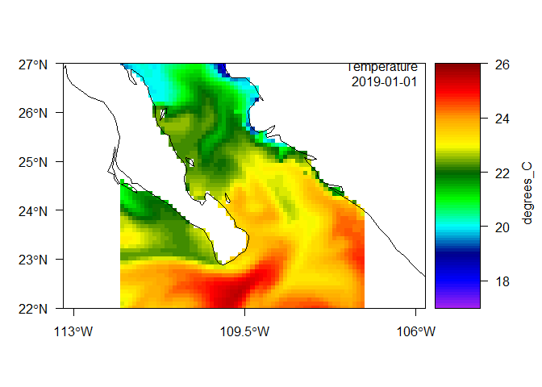
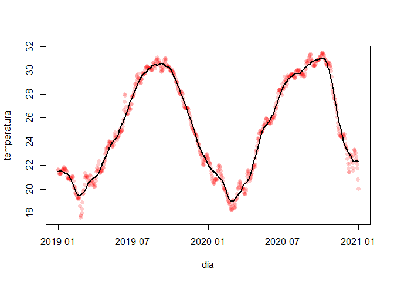
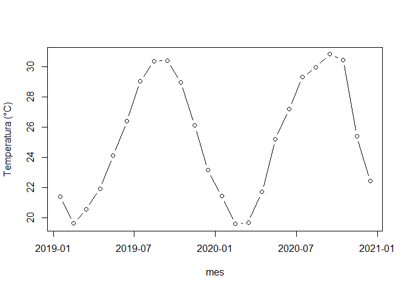

Datos temporales en R
================
Héctor Villalobos

## Introducción

Hablamos de datos temporales cuando las variables que se recolectan
tienen asociada una fecha y posiblemente una hora. El uso correcto de
estos datos depende de definir con toda claridad el formato en que esta
información se almacena. Por ejemplo, en los archivos (ascii o Excel) se
puede guardar el año, mes y día en columnas separadas, o combinados en
una misma columna como una cadena de texto o bien en un formato
especializado de fecha (en el caso de Excel).

Usualmente se usan solo números, por lo que tendríamos algo así como
“30-09-2024” (dd-mm-aaaa), aunque en algunos casos podría escribirse
como “2024/Sep/30” (aaaa/mmm/dd). El tiempo podría estar en una columna
aparte o también combinado con la fecha: “2024-09-30 15:30:58”
(aaaa-mm-dd hh:mm:ss).

Lo importante en todos los casos es la consistencia, y sobretodo no
invertir el orden del mes y el día ni escribir indistintamente “Sep”,
“sep” y “Septiembre” . Es sumamente importante revisar esto antes de
importar los datos en R.


Al importar en R desde archivos ascii con la función `read.table()`, la
clase de la variable con la fecha será `"character"`, lo cual
dificultará su uso en gráficos o para realizar operaciones, por lo que
debemos convertirlos a una clase apropiada para fecha o fecha-tiempo. En
cambio, al importar archivos Excel con la función `read_excel()` del
paquete **readxl** usualmente ya pasan como clase `POSIXct`, si el
formato no es ambiguo. A continuación se describen algunas de estas
clases especializadas.

## Clase `"Date"`

Esta es tal vez la clase más sencilla cuando solo tenemos fechas.

``` r
fechas <- paste("2024", c("09", "10", "11", "12"), c("13", "18", "25", "31"), sep ="-")
fechas
```

    [1] "2024-09-13" "2024-10-18" "2024-11-25" "2024-12-31"

En el ejemplo, el vector `fechas` es de clase `"character"`.

``` r
class(fechas)
```

    [1] "character"

La conversión a la clase `"Date"` se logra con la función `as.Date().`

``` r
fechas <- as.Date(fechas)
fechas
```

    [1] "2024-09-13" "2024-10-18" "2024-11-25" "2024-12-31"

``` r
class(fechas)
```

    [1] "Date"

Esta clase representa el número de días desde el 1 de enero de 1970.

``` r
unclass(fechas)
```

    [1] 19979 20014 20052 20088

``` r
origen <- as.Date("1970-01-01")
```

La resta siguiente nos debe dar los mismos valores obtenidos con
`unclass(fechas)`.

``` r
fechas - origen
```

    Time differences in days
    [1] 19979 20014 20052 20088

Con la función `Sys.time()` podemos obtener la fecha-hora actual de
acuerdo a la configuración local de nuestra computadora.

``` r
ahora <- Sys.time()
ahora
```

    [1] "2024-10-15 18:28:11 MST"

Al aplicar la función `as.Date()` la hora se descarta.

``` r
as.Date(ahora)
```

    [1] "2024-10-16"

## La clase `"POSIXlt"`

Las clases más utilizadas en R que permiten guardar la fecha, hora y la
zona de tiempo son **“POSIXlt”** y **“POSIXct”**. La primera almacena
esta información como una lista de vectores `sec`, `min`, `hour` para el
tiempo; `mday`, `mon` y `year` para la fecha; `wday` y `yday` para el
día de la semana y el día del año, respectivamente;`isdst`, es una
bandera para el horario de verano; `zone` es una cadena de texto para la
zona de tiempo; y `gmtoff` sería el *offset* en segundos del horario
GMT. La función `strptime()` nos permite convertir una cadena de texto a
la clase `"POSIXlt"`.

``` r
dt <- strptime("2024-10-18 07:12:30", format = "%Y-%m-%d %H:%M:%S", tz = "UTC")
dt
```

    [1] "2024-10-18 07:12:30 UTC"

``` r
class(dt)
```

    [1] "POSIXlt" "POSIXt" 

Pare ver los vectores mencionados antes, usamos nuevamente la función
`unclass()`.

``` r
unclass(dt)
```

    $sec
    [1] 30

    $min
    [1] 12

    $hour
    [1] 7

    $mday
    [1] 18

    $mon
    [1] 9

    $year
    [1] 124

    $wday
    [1] 5

    $yday
    [1] 291

    $isdst
    [1] 0

    $zone
    [1] "UTC"

    $gmtoff
    [1] 0

    attr(,"tzone")
    [1] "UTC"
    attr(,"balanced")
    [1] TRUE

También podemos usar la función `as.POSIXlt()` para convertir una cadena
de texto a la clase `"POSIXlt"`. En este caso, si no lo indicamos la
zona de tiempo se ajustará de acuerdo a nuestra configuración local.

``` r
psx.lt <- as.POSIXlt("2024-10-17 07:12:30")
psx.lt
```

    [1] "2024-10-17 07:12:30 MST"

``` r
class(psx.lt)
```

    [1] "POSIXlt" "POSIXt" 

## La clase `"POSIXct"`

Esta clase representa el número de segundos desde el primero de enero de
1970 (en UTC) como un vector numérico.

``` r
psx.ct <- as.POSIXct("2024-10-17 07:12:30", tz = "UTC")
psx.ct
```

    [1] "2024-10-17 07:12:30 UTC"

``` r
class(psx.ct)
```

    [1] "POSIXct" "POSIXt" 

Aplicando la función `unclass()` podemos ver el número de segundos
transcurridos desde el origen mencionado antes.

``` r
unclass(psx.ct)
```

    [1] 1729149150
    attr(,"tzone")
    [1] "UTC"

Esto lo podemos comprobar fácilmente.

``` r
# definir origen
orig <- as.POSIXct("1970-01-01 00:00:00", format = "%Y-%m-%d %H:%M:%S", tz = "UTC") 

# calcular la diferencia entre psx.ct y el origen
difftime(psx.ct, orig, units = "s")
```

    Time difference of 1729149150 secs

De acuerdo con la ayuda de R, la clase `"POSIXct"` es más conveniente
para incluirse en *data frames*, mientras que `"POSIXlt"`es una forma
más fácil de leer para el humano.

## Manipulación de datos temporales: temperatura potencial del mar diaria

Para ilustrar la manipulación de datos temporales utilizaremos
información del producto *Global Ocean Physics Reanalysis*
(<https://doi.org/10.48670/moi-00021>) de Copernicus
(<https://marine.copernicus.eu/>).

El archivo netCDF proporcionado contiene datos diarios de temperatura
potencial para una región del Golfo de California, México. El periodo
abarca del primero de enero de 2019 al 31 de diciembre de 2020. En este
archivo la información de la fecha podemos verla con el siguiente código

``` r
library(ncdf4)
ncf <- nc_open("./datos/cmems_mod_glo_phy_my_0.083deg_P1D-m_1728505215428.nc")
time <- ncf$dim$time$vals
head(time)
```

    [1] 1546300800 1546387200 1546473600 1546560000 1546646400 1546732800

Inspeccionando un poco el archivo (tecleando ncf en la consola) podemos
notar que estos números son: “units: seconds since 1970-01-01 00:00:00”,
por lo que la conversión apropiada sería

``` r
time <- as.POSIXct(time, tz = "UTC", format = "%Y-%m-%d", 
                   origin = "1970-01-01 00:00:00")
head(time)
```

    [1] "2019-01-01 UTC" "2019-01-02 UTC" "2019-01-03 UTC" "2019-01-04 UTC"
    [5] "2019-01-05 UTC" "2019-01-06 UTC"

El proceso anterior se encuentra codificado en la función `read.cmems()`
del paquete **satin**, que además prevee otros casos en los que el
origen o las unidades (horas, días) pudieran ser diferentes.

``` r
# cargar paquete devtools
#library(devtools)

# instalar 'satin' desde github
#install_github("hvillalo/satin")

# cargar paquete satin
library(satin)
```

Importar el archivo netCDF anterior con la función `read.cmems()`.

``` r
thetao <- read.cmems("./datos/cmems_mod_glo_phy_my_0.083deg_P1D-m_1728505215428.nc")
```

Ahora inspeccionamos el archivo importado, comenzando por la clase del
objeto `"thetao"`.

``` r
class(thetao)
```

    [1] "satin"
    attr(,"package")
    [1] "satin"

y su contenido…

``` r
thetao
```

    Object of class satin

     Title: thetao 
     Long name: Temperature 
     Name: thetao 
     Units: degrees_C 
     Temporal range: daily 
     Spatial resolution: 9.2 km 

    Data dimensions:
     61 60 731 2 

    Data ranges:
              lon lat   thetao     period    depth
    min -112.0000  22 13.78762 2019-01-01 0.494025
    max -107.0833  27 32.84582 2020-12-31 1.541375

Podemos ver que tenemos datos diarios de temperatura en °C, con una
resolución espacial de 9.2 km. En total son 731 días , del 2019-01-01 al
2020-12-31 y a 2 niveles de profundidad diferentes, 0.49 y 1.54 m. En
este objeto de clase S4 podemos extraer sus diferentes componentes
(“slots”) usando “@”:

``` r
head(thetao@period$tmStart); tail(thetao@period$tmStart)
```

    [1] "2019-01-01 UTC" "2019-01-02 UTC" "2019-01-03 UTC" "2019-01-04 UTC"
    [5] "2019-01-05 UTC" "2019-01-06 UTC"

    [1] "2020-12-26 UTC" "2020-12-27 UTC" "2020-12-28 UTC" "2020-12-29 UTC"
    [5] "2020-12-30 UTC" "2020-12-31 UTC"

Haremos un mapa para elegir un punto y extraer los valores de
temperatura en el nivel más superficial

``` r
plot(thetao)
```



Tomemos por ejemplo un pixel a los 26° de lat N y 110° de lon W

``` r
pt <- data.frame(x = -110, y = 26)
sst <- extractPts(thetao, points = pt)
dim(sst)
```

    [1]    1 1468

En sst están los valores de temperatura potencial para el punto
seleccionado, en los 731 díasy para los 5 niveles de profundidad 731
$\times$ 5 = 3655. Las primeras seis columnas adicionales en sst
contienen el id del punto o puntos elegidos, las coordenadas de
latitud-longitud elegidas, las coordenadas del pixel más cercano donde
hay datos y la distancia entres el punto elegido y el dato devuelto,
solo como un control

``` r
sst[ , 1:10]
```

      id    x  y d  lon lat       p1      p2       p3       p4
    1  1 -110 26 0 -110  26 21.68557 21.6072 21.40651 21.27906

Para repesentar la serie de tiempo podemos rearreglar nuestros datos
extraidos de la siguiente manera

``` r
fecha <- thetao@period$tmStart
tsm <- data.frame(fecha, temperatura = t(sst[ , 7:(731+6)]))
head(tsm)
```

            fecha temperatura
    p1 2019-01-01    21.68557
    p2 2019-01-02    21.60720
    p3 2019-01-03    21.40651
    p4 2019-01-04    21.27906
    p5 2019-01-05    21.27906
    p6 2019-01-06    21.24976

Figura

``` r
plot(tsm, type = "b", pch = 16, col = rgb(1, 0, 0, 0.2))
```



Si quisieramos los promedios mensuales

``` r
library(lubridate)
```


    Attaching package: 'lubridate'

    The following objects are masked from 'package:base':

        date, intersect, setdiff, union

``` r
tsm$mes <- month(tsm$fecha)
tsm$año <- year(tsm$fecha)
head(tsm)
```

            fecha temperatura mes  año
    p1 2019-01-01    21.68557   1 2019
    p2 2019-01-02    21.60720   1 2019
    p3 2019-01-03    21.40651   1 2019
    p4 2019-01-04    21.27906   1 2019
    p5 2019-01-05    21.27906   1 2019
    p6 2019-01-06    21.24976   1 2019

Suavizado con promedios móviles

``` r
library(smooth)
```

    Loading required package: greybox

    Package "greybox", v2.0.1 loaded.


    Attaching package: 'greybox'

    The following object is masked from 'package:lubridate':

        hm

    This is package "smooth", v4.0.2

``` r
sm <- cma(tsm$temperatura, order = 30)
tsm$sm <- sm$fitted

plot(tsm$fecha, tsm$temperatura, type = "b", pch = 16, col = rgb(1, 0, 0, 0.2),
     xlab = "día", ylab = "temperatura")
lines(tsm$fecha, tsm$sm, lwd = 2)
```


Agregar por año mes

``` r
tsm.mens <- aggregate(tsm$temperatura, by = list(mes = tsm$mes, año = tsm$año), mean)
tsm.mens
```

       mes  año        x
    1    1 2019 21.36710
    2    2 2019 19.60258
    3    3 2019 20.55122
    4    4 2019 21.91614
    5    5 2019 24.13084
    6    6 2019 26.40666
    7    7 2019 29.07128
    8    8 2019 30.37952
    9    9 2019 30.43024
    10  10 2019 28.98196
    11  11 2019 26.10929
    12  12 2019 23.13966
    13   1 2020 21.42255
    14   2 2020 19.56633
    15   3 2020 19.65863
    16   4 2020 21.70246
    17   5 2020 25.21871
    18   6 2020 27.20578
    19   7 2020 29.32309
    20   8 2020 29.98454
    21   9 2020 30.84051
    22  10 2020 30.47426
    23  11 2020 25.42008
    24  12 2020 22.43016

``` r
plot(as.Date(paste(tsm.mens$año, tsm.mens$mes, 15, sep = "-")), tsm.mens$x,
     xlab = "mes", ylab = "temperatura (°C)", type = "b")
```



  
