Estadística descriptiva con datos espaciales
================

<!-- # Pre-requisitos -->

### Objetivo

- En este tutorial se muestra como realizar un análisis estadístico con
  datos espaciales en R.

### Directo a los datos

``` r
# Cargar datos
dm <- read.csv("Data/datos_marinos.csv")

head(dm)   # primeras 6 filas
```

    ##         lon      lat temperatura clorofila   altura
    ## 1 -107.4819 22.96456    29.38014 1.8987200 813.8341
    ## 2 -110.1372 25.71715    24.36231 0.8547638 461.4124
    ## 3 -112.6811 24.49201    21.33431 0.9390272 387.8842
    ## 4 -109.3033 23.91933    32.26804 0.6411606 989.5937
    ## 5 -109.1400 22.85032    28.31804 0.4162545 623.4746
    ## 6 -108.2570 24.15844    28.06885 2.3591057 842.3284

``` r
summary(dm)  # resumen estadístico
```

    ##       lon              lat         temperatura      clorofila      
    ##  Min.   :-113.0   Min.   :22.00   Min.   :16.57   Min.   : 0.1131  
    ##  1st Qu.:-111.5   1st Qu.:22.84   1st Qu.:24.79   1st Qu.: 1.4772  
    ##  Median :-110.4   Median :23.78   Median :27.37   Median : 2.3027  
    ##  Mean   :-110.1   Mean   :24.10   Mean   :26.97   Mean   : 3.0991  
    ##  3rd Qu.:-108.8   3rd Qu.:25.17   3rd Qu.:29.26   3rd Qu.: 4.2628  
    ##  Max.   :-106.1   Max.   :27.99   Max.   :33.13   Max.   :14.0680  
    ##      altura      
    ##  Min.   : 354.5  
    ##  1st Qu.: 627.0  
    ##  Median : 767.4  
    ##  Mean   : 763.1  
    ##  3rd Qu.: 902.3  
    ##  Max.   :1305.7

El dataset contiene información sobre la distribución de peces en la
costa de California. Las variables son: longitud, latitud, temperatura,
clorofila y altura.

> ¿Qué tipo de variables contiene el dataframe?

> ¿Cuáles estadísticos descriptivos echan en falta?

Vamos a explorar los datos con gráficos.

``` r
#  Vistazo general de las variables
# Función para graficar histograma y boxplot en una misma ventana

for (i in 3:5) {
  par(mfrow = c(1, 2))   # 1 fila y 2 columnas
  n <- names(dm)[i]
  # Histograma
  hist(dm[, i], main = "", xlab = n,  col = "lightblue")
  
  # Boxplot
  boxplot(dm[, i], main = "", horizontal = TRUE, col = "plum")
}
```

<!-- -->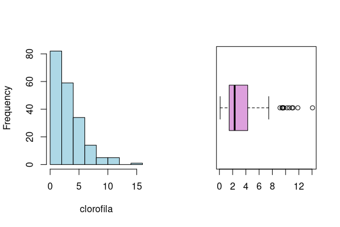<!-- -->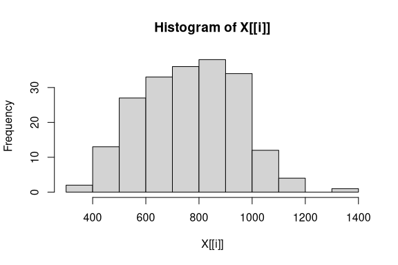<!-- -->

``` r
# Restaurar la configuración original
par(mfrow = c(1,1))


# versiòn simple
# lapply(dm[,3:5], hist)
# lapply(dm[,3:5], boxplot)
```

### ~ “Unión” de histogramas y boxplots

``` r
# Graficos de violín
par(mfrow=c(1,3)) # presentar 3 gráficos en 1 fila, 3 columnas
vioplot(dm$temperatura, col="lightblue", main="Temperatura", horizontal=TRUE)
vioplot(dm$clorofila, col="darkseagreen", main="Clorofila")
vioplot(dm$altura, col="lightpink", main="altura")
```

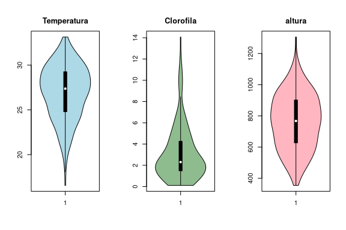<!-- -->

``` r
par(mfrow=c(1,1))  # volver a 1 gráfico

# ayuda
# ?vioplot
```

Los gráficos previos sirven para analizar las variables de manera
individual. Para analizar las relaciones entre las variables, usaremos
los gráficos de dispersión y la matriz de correlaciones.

### Correlación

``` r
(cor_mat <- cor(dm[,3:5])) # Matriz de correlaciones
```

    ##             temperatura   clorofila    altura
    ## temperatura  1.00000000 -0.02648653 0.3089847
    ## clorofila   -0.02648653  1.00000000 0.5202820
    ## altura       0.30898474  0.52028204 1.0000000

``` r
# Gráficos de dispersión
pairs(dm[,3:5], pch=19, col="tan")
```

<!-- -->

``` r
# Visualización con corrplot
corrplot(cor_mat, method = "circle", type = "upper",
         col = colorRampPalette(c("orangered", "white", "mediumseagreen"))(200),
         tl.col = "darkslateblue", tl.srt = 45, 
         addCoef.col = "midnightblue", number.cex = 0.8)
```

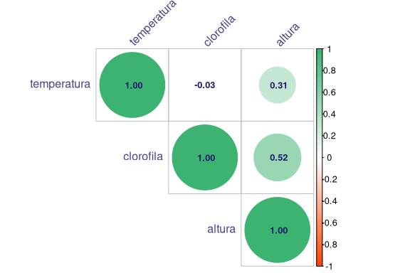<!-- -->

> ¿Qué variables hemos dejado de lado?

> ¿Por qué no las podemos obviar?

### Necesidad de modelos espaciales

Cuando tenemos este tipo de datos:

- Abundancia de peces a lo largo de la costa.  
- Contaminación en estaciones de monitoreo.  
- Distribución de mamíferos marinos.

Las observaciones **tienen dependencia espacial**:

- Se viola el supuesto de independencia en modelos de regresión clásica
  → estimaciones sesgadas e inferencias incorrectas.

### Datos espaciales

Visualización de la variable altura en el mapa, usando longitud y
latitud

Un primer intento usado Rbase:

``` r
# Convertir a objeto espacial (CRS WGS84)
dm_sp <- st_as_sf(dm, coords = c("lon", "lat"), crs = 4326)

# Gráfico simple. El gradiente de color va de menor a mayor altura
plot(dm_sp["altura"], main = "altura", pch=18, axes=T)
```

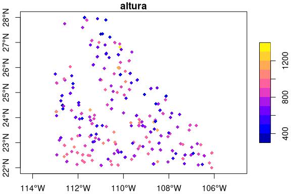<!-- -->

``` r
# Gráfico con escala. El tamaño de los puntos va de menor a mayor altura
plot(dm_sp["altura"], 
     cex = scales::rescale(dm_sp$altura, to=c(1,4)),
     col = "mediumblue", pch = 22,
     main = "altura ", axes=T)
```

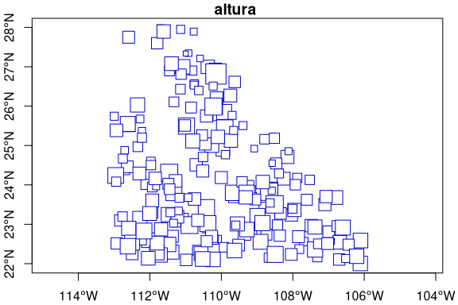<!-- -->

Ahora usando `ggplot()`:

``` r
# Definir límites  de los ejes
xlim <- c(min(dm$lon) - 0.2, max(dm$lon) + 0.2)
ylim <- c(min(dm$lat) - 0.2, max(dm$lat) + 0.2)


ggplot() +
  borders("world", xlim = xlim, ylim = ylim,
          fill = "gray90", colour = "gray70") +
  geom_point(data = dm,
             aes(x = lon, y = lat, colour = altura),
             size = 2) +
  scale_color_gradient(low = "lightblue", high = "darkred") +
  coord_sf(xlim = xlim, ylim = ylim, expand = FALSE) +
  labs(title = "",
       x = "Lon", y = "Lat", colour = "Altura") +
  theme_minimal()
```

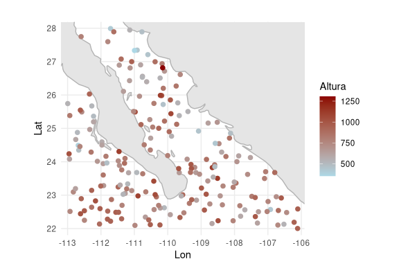<!-- -->

> ¿Qué le cambiamos al código anterior para graficar las otras dos
> variables?

``` r
ggplot() +
  borders("world", xlim = xlim, ylim = ylim,
          fill = "gray90", colour = "gray70") +
  geom_point(data = dm,
             aes(x = lon, y = lat, colour = clorofila),
             size = 2) +
  scale_color_gradient(low = "lightblue", high = "darkred") +
  coord_sf(xlim = xlim, ylim = ylim, expand = FALSE) +
  labs(title = "",
       x = "Lon", y = "Lat", colour = "Clorofila") +
  theme_minimal()
```

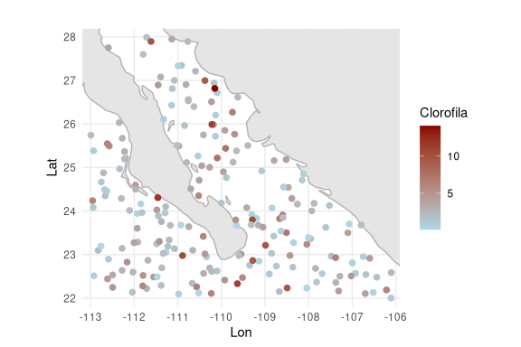<!-- -->

### ¿Qué pasa con los cuantiles?

Con `cut_number(x,n)` podemos calcular los cuantiles de las variables.
Al usar `n = 4`, los puntos se colorean por **cuartiles**.

``` r
ggplot(dm, aes(x = lon, y = lat)) +
  borders("world", xlim = range(dm$lon), ylim = range(dm$lat),
          fill = "gray90", colour = "gray70") +
  geom_point(aes(color = cut_number(altura, n=4)), size = 2 ) +   # 4 cuartiles
  scale_color_brewer(palette = "RdYlBu", name = "Cuartiles") +
  coord_sf(xlim = range(dm$lon), ylim = range(dm$lat), expand = FALSE) +
  theme_minimal() +
  labs(title = "Altura ")
```

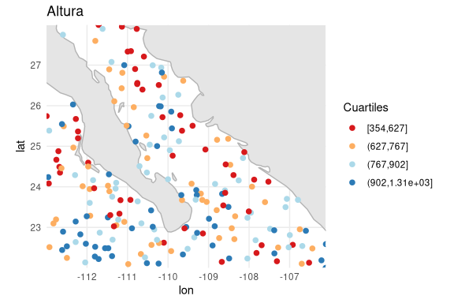<!-- -->

``` r
# Calculo de los cuartiles
quantile(dm$altura, probs = seq(0, 1, 0.25))
```

    ##        0%       25%       50%       75%      100% 
    ##  354.4931  626.9678  767.4058  902.2993 1305.6816

``` r
# Recordando 
# vioplot(dm$altura, col="lightpink", main="altura")
```

> ¿Cómo se modificaría el código para obtener los deciles?

### Bivariado

Representando dos variables en el mismo gráfico.

El gráfico utiliza el color para mostrar la variación de la temperatura
en el espacio, y el tamaño de los puntos para reflejar la altura
observada en cada punto de muestreo.

``` r
ggplot(dm, aes(x = lon, y = lat)) +
  borders("world", fill="gray90", colour="gray70") +
  geom_point(aes(size = altura, color = temperatura), alpha = 0.6) +
  scale_color_viridis_c() +
  coord_sf(xlim = range(dm$lon), ylim = range(dm$lat)) +
  theme_minimal()
```

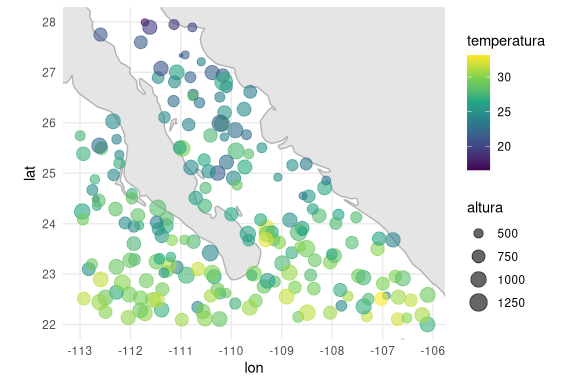<!-- -->

Regresando a los cuantiles, pero ahora usando la variable clorofila

``` r
ggplot(dm, aes(x = lon, y = lat)) +
  borders("world", fill="gray90", colour="gray70") +
  geom_point(aes(size = altura, color = cut_number(clorofila, 2)), alpha = 0.7) +
  scale_color_brewer(palette = "RdYlBu", name = "Cuartiles") +
  coord_sf(xlim = range(dm$lon), ylim = range(dm$lat)) +
  theme_minimal()
```

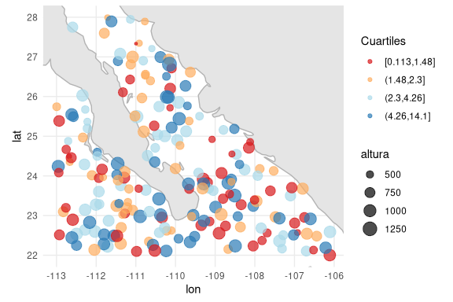<!-- -->

> ¿Qué aspecto estoy resaltando en este gráfico si solo utilizo un punto
> de corte?

> ¿Cómo se llama ese punto de corte?

#### Numéricamente

Para ver los descriptivos de la variable altura según el valor de la
variable clorofila:

``` r
aggregate(altura ~ cut_number(clorofila, 4), summary, data = dm)
```

    ##   cut_number(clorofila, 4) altura.Min. altura.1st Qu. altura.Median altura.Mean
    ## 1             [0.113,1.48]    354.4931       596.2898      714.3090    698.8389
    ## 2               (1.48,2.3]    419.2508       555.3741      699.6815    691.0992
    ## 3               (2.3,4.26]    451.2278       651.1205      800.0837    770.9932
    ## 4              (4.26,14.1]    540.7483       773.5896      929.8067    891.4488
    ##   altura.3rd Qu. altura.Max.
    ## 1       822.2590    989.5937
    ## 2       811.2815    990.5646
    ## 3       886.8950   1048.3422
    ## 4      1007.0821   1305.6816

### Outliers

Usando un box-plot podemos ver si nuestra variable tiene outliers. ¿Cómo
se vería esto espacialmente?

``` r
# Recreamos un box-plot
vb <- dm$clorofila

q <- quantile(vb, probs = c(0.25, 0.5, 0.75))
iqr <- IQR(vb)

# Bigotes
lw <- q[1] - 1.5 * iqr
up <- q[3] + 1.5 * iqr

# Variable categórica que indica el cuartil al que pertenece cada observación o si se considera  un outlier
dm$boxcat <- cut(
  vb,
  breaks = c(-Inf, lw, q[1], q[2], q[3], up, Inf),
  labels = c("Extremo bajo", "Q1", "Q2", "Q3", "Q4", "Extremo alto"),
  include.lowest = TRUE
)

# El mapa
xlim <- range(dm$lon) + c(-0.2, 0.2)
ylim <- range(dm$lat) + c(-0.2, 0.2)

ggplot(dm, aes(x = lon, y = lat)) +
  borders("world", xlim = xlim, ylim = ylim,
          fill = "gray90", colour = "gray70") +
  geom_point(aes(color = boxcat), size = 3) +   # El color depende de la variable boxcat
  scale_color_manual(values = c(
    "Extremo bajo" = "blue",
    "Q1"           = "lightblue",
    "Q2"           = "green",
    "Q3"           = "orange",
    "Q4"           = "red",
    "Extremo alto" = "darkred"
  )) +
  coord_sf(xlim = xlim, ylim = ylim, expand = FALSE) +
  theme_minimal() +
  labs(title = "",
       x = "Longitud", y = "Latitud",
       color = "Categoría")
```

<!-- -->

> Probemos con las otras dos variables: altura y temperatura

El gráfico anterior **únicamente** permite identificar los valores
atípicos **globales**, perooooo…

¿De qué manera podemos reconocer outliers locales: puntos que resultan
“raros” en comparación con sus vecinos? Por ejemplo, un sitio con altura
pequeña rodeado de puntos con alturas mucho mayores.

### Dependencia espacial

En datos espaciales, lo cercano suele parecerse más que lo lejano:

- Similares se agrupan → autocorrelación positiva.

- Cercanos son distintos → autocorrelación negativa. Patrón ajedrezado

- Sin patrón visible → distribución aleatoria.

### ¿A quién puedo considerar vecinos?

- Contigüidad: dos regiones son vecinas si comparten frontera (útil con
  polígonos).

- Distancia fija: puntos dentro de un radio definido son vecinos.

- k vecinos más cercanos (k-NN): cada punto tiene como vecinos a los k
  puntos más cercanos.

La función `knearneigh()` de la librería `spdep` nos permite obtener la
matriz de vecinos: devuelve una matriz con los índices de los puntos que
forman parte del conjunto de los k vecinos más cercanos de cada punto

``` r
# Matriz de coordenadas
coords <- cbind(dm$lon, dm$lat)

# Distancia (radio = 0.5 grados aprox.)
nb_dist <- dnearneigh(coords, 0,0.5)

# knn (4 vecinos)
nb_knn <- knn2nb(knearneigh(coords, k=4))


par(mfrow=c(1,2))
plot(nb_dist, coords, main="Vecinos por distancia", col="deepskyblue")
plot(nb_knn, coords, main="Vecinos k-NN (k=4)", col="coral")
```

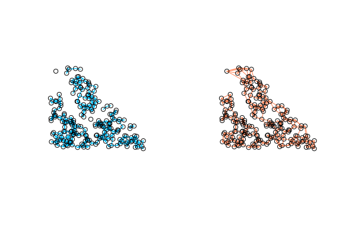<!-- -->

Para seguir con el tutorial, usaremos k-NN.

### Matriz de pesos

Para representar la cercanía entre puntos, se construye una **matriz
cuadrada** $W$ de dimensión $n \times n$, donde $n$ es el número total
de puntos.

Cada elemento $w_{ij}$ indica la relación espacial entre la ubicación
$i$ y la $j$:

- $w_{ij} = 1$ si el punto $j$ es vecino de $i$.  
- $w_{ij} = 0$ en caso contrario.

Generalmente, $W$ se **estandariza por filas**, de modo que la suma de
los elementos de cada fila sea igual a 1.

Al multiplicar $W$ por una variable, se obtiene la media ponderada, es
decir, el valor medio de su vecindad.

$$
W =
\begin{bmatrix}
0 & 0.5 & 0.5 \\
0.5 & 0 & 0.5 \\
0.5 & 0.5 & 0 
\end{bmatrix}
\quad\text{y}\quad
\text{altura} =
\begin{bmatrix}
10 \\
20 \\
30
\end{bmatrix}
$$

Al multiplicar:

$$
W \times \text{altura} =
\begin{bmatrix}
0.5\times20 + 0.5\times30 \\
0.5\times10 + 0.5\times30 \\
0.5\times10 + 0.5\times20
\end{bmatrix}
=
\begin{bmatrix}
25 \\
20 \\
15
\end{bmatrix}
$$

Esto permite detectar patrones espaciales: por ejemplo, si un punto
tiene un valor muy distinto al promedio de sus vecinos, podría ser un
outlier local.

### Moran’s I

Este índice indica si los valores de una variable están agrupados,
dispersos o distribuidos al azar, comparando cada valor con los de sus
vecinos.

Toma valores entre –1 y +1. Los valores cercanos a los extremos indican
un patrón espacial; un valor de 0 corresponde a un patrón aleatorio.

Para ver los patrones de agrupación local se utiliza el Indicador Local
de Asociación de Moran (LISA):

- High-High (HH): valores altos rodeados de valores altos

- Low-Low (LL): valores bajos rodeados de valores bajos

- High-Low (HL): valor alto rodeado de valores bajos

- Low-High (LH): valor bajo rodeado de valores altos

### Gráficamente

Ahora si podemos ver los outliers espacialmente.

``` r
W <- nb2listw(nb_knn, style = "W")

# Moran's I
lisa <- localmoran(dm$altura, W)

# Creando las etiquetas tomando como referencia a la media
dm$lisa_cat <- NA
ref_val <- mean(dm$altura)

for (i in 1:nrow(dm)) {
  if (dm$altura[i] >= ref_val & lisa[i,1] > 0) {
    dm$lisa_cat[i] <- "High-High"
  } else if (dm$altura[i] < ref_val & lisa[i,1] > 0) {
    dm$lisa_cat[i] <- "Low-Low"
  } else if (dm$altura[i] >= ref_val & lisa[i,1] < 0) {
    dm$lisa_cat[i] <- "High-Low"
  } else if (dm$altura[i] < ref_val & lisa[i,1] < 0) {
    dm$lisa_cat[i] <- "Low-High"
  }
}

dm$lisa_cat <- factor(dm$lisa_cat,
                            levels = c("High-High","Low-Low","High-Low","Low-High"))

# El gráfico
xlim <- range(dm$lon) + c(-0.2, 0.2)
ylim <- range(dm$lat) + c(-0.2, 0.2)

ggplot(dm, aes(x = lon, y = lat)) +
  borders("world", xlim = xlim, ylim = ylim,
          fill = "gray90", colour = "gray70") +
  geom_point(aes(color = lisa_cat), size = 3) +
  scale_color_manual(values = c(
    "High-High" = "darkred",
    "Low-Low"   = "darkblue",
    "High-Low"  = "orange",
    "Low-High"  = "skyblue"
  )) +
  coord_sf(xlim = xlim, ylim = ylim, expand = FALSE) +
  theme_minimal() +
  labs(title = "Mapa de outliers espaciales LISA (Altura)",
       x = "Longitud", y = "Latitud",
       color = "Categoría LISA")
```

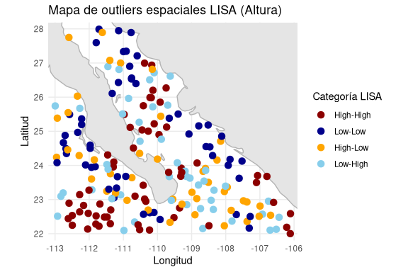<!-- -->

> ¿Qué más puedo hacer?

- Gráficos de dispersión con lag espacial `moran.plot()`
- Correlogramas espaciales: muestra hasta qué escala espacial existe
  correlación
- Modelos espaciales: SAR (Spatial Autoregressive), SEM (Spatial Error
  Model), la combinación de ambos SAC (Spatial Autoregressive Combined),
  etc.
- Heterocedasticidad espacial: cuando la variabilidad de los datos
  cambia en el espacio. Es decir, algunas zonas presentan mucha
  variabilidad en la variable de interés, mientras que otras son más
  homogéneas.

<!-- moran.plot(dm_golfo$altura, listw = W,
           xlab = "Altura observada",
           ylab = "Lag espacial (media de los vecinos)") -->

<!-- El eje **Y** muestra el **lag espacial**, es decir, la **media ponderada de los valores en los vecinos** (definidos por la matriz \(W\)). -->
