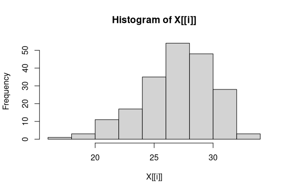
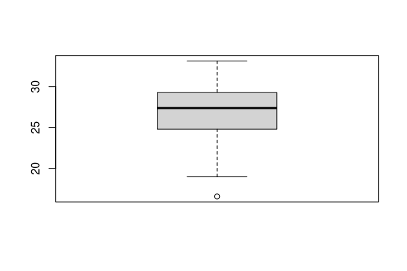
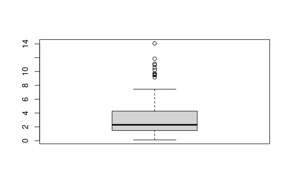
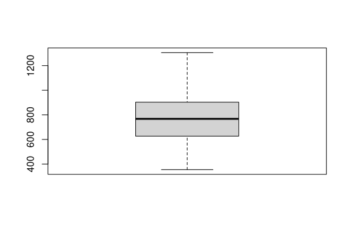

Introducción al análisis espacial
================

<!-- # Pre-requisitos -->

### Objetivo

- En este tutorial se muestra como realizar un análisis estadístico con
  datos espaciales en R.

### Directo a los datos

``` r
# Cargar datos
dm <- read.csv("Data/datos_marinos.csv")

head(dm)   # primeras 6 filas
```

    ##         lon      lat temperatura clorofila   altura
    ## 1 -107.4819 22.96456    29.38014 1.8987200 813.8341
    ## 2 -110.1372 25.71715    24.36231 0.8547638 461.4124
    ## 3 -112.6811 24.49201    21.33431 0.9390272 387.8842
    ## 4 -109.3033 23.91933    32.26804 0.6411606 989.5937
    ## 5 -109.1400 22.85032    28.31804 0.4162545 623.4746
    ## 6 -108.2570 24.15844    28.06885 2.3591057 842.3284

``` r
summary(dm)  # resumen estadístico
```

    ##       lon              lat         temperatura      clorofila      
    ##  Min.   :-113.0   Min.   :22.00   Min.   :16.57   Min.   : 0.1131  
    ##  1st Qu.:-111.5   1st Qu.:22.84   1st Qu.:24.79   1st Qu.: 1.4772  
    ##  Median :-110.4   Median :23.78   Median :27.37   Median : 2.3027  
    ##  Mean   :-110.1   Mean   :24.10   Mean   :26.97   Mean   : 3.0991  
    ##  3rd Qu.:-108.8   3rd Qu.:25.17   3rd Qu.:29.26   3rd Qu.: 4.2628  
    ##  Max.   :-106.1   Max.   :27.99   Max.   :33.13   Max.   :14.0680  
    ##      altura      
    ##  Min.   : 354.5  
    ##  1st Qu.: 627.0  
    ##  Median : 767.4  
    ##  Mean   : 763.1  
    ##  3rd Qu.: 902.3  
    ##  Max.   :1305.7

El dataset contiene información sobre la distribución de algas en la
costa de California. Las variables son: longitud, latitud, temperatura,
clorofila y altura.

> ¿Qué tipo de variables contiene el dataframe?

> ¿Cuáles estadísticos descriptivos echan en falta?

Vamos a explorar los datos con gráficos.

``` r
#  Vistazo general de las variables
lapply(dm[,3:5], hist) # histogramas
```

<!-- --><!-- --><!-- -->

    ## $temperatura
    ## $breaks
    ##  [1] 16 18 20 22 24 26 28 30 32 34
    ## 
    ## $counts
    ## [1]  1  3 11 17 35 54 48 28  3
    ## 
    ## $density
    ## [1] 0.0025 0.0075 0.0275 0.0425 0.0875 0.1350 0.1200 0.0700 0.0075
    ## 
    ## $mids
    ## [1] 17 19 21 23 25 27 29 31 33
    ## 
    ## $xname
    ## [1] "X[[i]]"
    ## 
    ## $equidist
    ## [1] TRUE
    ## 
    ## attr(,"class")
    ## [1] "histogram"
    ## 
    ## $clorofila
    ## $breaks
    ## [1]  0  2  4  6  8 10 12 14 16
    ## 
    ## $counts
    ## [1] 82 59 34 14  5  5  0  1
    ## 
    ## $density
    ## [1] 0.2050 0.1475 0.0850 0.0350 0.0125 0.0125 0.0000 0.0025
    ## 
    ## $mids
    ## [1]  1  3  5  7  9 11 13 15
    ## 
    ## $xname
    ## [1] "X[[i]]"
    ## 
    ## $equidist
    ## [1] TRUE
    ## 
    ## attr(,"class")
    ## [1] "histogram"
    ## 
    ## $altura
    ## $breaks
    ##  [1]  300  400  500  600  700  800  900 1000 1100 1200 1300 1400
    ## 
    ## $counts
    ##  [1]  2 13 27 33 36 38 34 12  4  0  1
    ## 
    ## $density
    ##  [1] 0.00010 0.00065 0.00135 0.00165 0.00180 0.00190 0.00170 0.00060 0.00020
    ## [10] 0.00000 0.00005
    ## 
    ## $mids
    ##  [1]  350  450  550  650  750  850  950 1050 1150 1250 1350
    ## 
    ## $xname
    ## [1] "X[[i]]"
    ## 
    ## $equidist
    ## [1] TRUE
    ## 
    ## attr(,"class")
    ## [1] "histogram"

``` r
lapply(dm[,3:5], boxplot) # boxplots
```

<!-- --><!-- --><!-- -->

    ## $temperatura
    ## $temperatura$stats
    ##          [,1]
    ## [1,] 18.97260
    ## [2,] 24.78920
    ## [3,] 27.37131
    ## [4,] 29.27207
    ## [5,] 33.13158
    ## 
    ## $temperatura$n
    ## [1] 200
    ## 
    ## $temperatura$conf
    ##          [,1]
    ## [1,] 26.87047
    ## [2,] 27.87215
    ## 
    ## $temperatura$out
    ## [1] 16.5687
    ## 
    ## $temperatura$group
    ## [1] 1
    ## 
    ## $temperatura$names
    ## [1] "1"
    ## 
    ## 
    ## $clorofila
    ## $clorofila$stats
    ##           [,1]
    ## [1,] 0.1131069
    ## [2,] 1.4736985
    ## [3,] 2.3027290
    ## [4,] 4.2793575
    ## [5,] 7.4494559
    ## 
    ## $clorofila$n
    ## [1] 200
    ## 
    ## $clorofila$conf
    ##          [,1]
    ## [1,] 1.989273
    ## [2,] 2.616185
    ## 
    ## $clorofila$out
    ##  [1]  9.161034 11.851342 10.225413 10.566378 14.067958  9.605023 11.123718
    ##  [8]  9.735566  9.539595 10.973952  9.465595
    ## 
    ## $clorofila$group
    ##  [1] 1 1 1 1 1 1 1 1 1 1 1
    ## 
    ## $clorofila$names
    ## [1] "1"
    ## 
    ## 
    ## $altura
    ## $altura$stats
    ##           [,1]
    ## [1,]  354.4931
    ## [2,]  626.8033
    ## [3,]  767.4058
    ## [4,]  903.1202
    ## [5,] 1305.6816
    ## 
    ## $altura$n
    ## [1] 200
    ## 
    ## $altura$conf
    ##          [,1]
    ## [1,] 736.5349
    ## [2,] 798.2767
    ## 
    ## $altura$out
    ## numeric(0)
    ## 
    ## $altura$group
    ## numeric(0)
    ## 
    ## $altura$names
    ## [1] "1"

### ~ “Unión” de histogramas y boxplots

``` r
# Graficos de violín
par(mfrow=c(1,3)) # presentar 3 gráficos en 1 fila, 3 columnas
vioplot(dm$temperatura, col="lightblue", main="Temperatura")
vioplot(dm$clorofila, col="darkseagreen", main="Clorofila")
vioplot(dm$altura, col="lightpink", main="altura")
```

<!-- -->

``` r
par(mfrow=c(1,1))  # volver a 1 gráfico
```

Los gráficos previos sirven para analizar las variables de manera
individual. Para analizar las relaciones entre las variables, usaremos
la correlación.

### Correlación

``` r
(cor_mat <- cor(dm[,3:5])) # Matriz de correlaciones
```

    ##             temperatura   clorofila    altura
    ## temperatura  1.00000000 -0.02648653 0.3089847
    ## clorofila   -0.02648653  1.00000000 0.5202820
    ## altura       0.30898474  0.52028204 1.0000000

``` r
# Gráficos de dispersión
pairs(dm[,3:5], pch=19, col="tan")
```

<!-- -->

``` r
# Visualización con corrplot
corrplot(cor_mat, method = "circle", type = "upper",
         col = colorRampPalette(c("orangered", "white", "mediumseagreen"))(200),
         tl.col = "darkslateblue", tl.srt = 45, 
         addCoef.col = "midnightblue", number.cex = 0.8)
```

<!-- -->

> ¿Qué variables hemos dejado de lado?

> ¿Por qué no las podemos obviar?

### Necesidad de modelos espaciales

Cuando tenemos este tipo de datos:

- abundancia de peces a lo largo de la costa.  
- Contaminación en estaciones de monitoreo.  
- Distribución de mamíferos marinos.

Las observaciones **tienen dependencia espacial**:

- Se viola el supuesto de independencia en modelos de regresión clásica
  → estimaciones sesgadas e inferencias incorrectas.

### Datos espaciales

``` r
# Convertir a objeto espacial (CRS WGS84)
dm_sp <- st_as_sf(dm, coords = c("lon", "lat"), crs = 4326)


# Gráfico simple. El gradiente de color va de menor a mayor altura
# plot(dm_sp["altura"], main = "altura", pch=18, axes=T)

# Gráfico con escala. El tamaño de los puntos va de menor a mayor altura
# plot(dm_sp["altura"], 
#      cex = scales::rescale(dm_sp$altura, to=c(1,4)),
#      col = "darkblue", pch = 19,
#      main = "altura ", axes=T)


# Definir límites 
xlim <- c(min(dm$lon) - 0.2, max(dm$lon) + 0.2)
ylim <- c(min(dm$lat) - 0.2, max(dm$lat) + 0.2)


ggplot() +
  borders("world", xlim = xlim, ylim = ylim,
          fill = "gray90", colour = "gray70") +
  geom_point(data = dm,
             aes(x = lon, y = lat, colour = altura),
             size = 2) +
  scale_color_gradient(low = "lightblue", high = "darkred") +
  coord_sf(xlim = xlim, ylim = ylim, expand = FALSE) +
  labs(title = "",
       x = "Lon", y = "Lat", colour = "Altura") +
  theme_minimal()
```

<!-- -->

> Hacer el gráfico de las otras dos variables

``` r
ggplot() +
  borders("world", xlim = xlim, ylim = ylim,
          fill = "gray90", colour = "gray70") +
  geom_point(data = dm,
             aes(x = lon, y = lat, colour = clorofila),
             size = 2) +
  scale_color_gradient(low = "lightblue", high = "darkred") +
  coord_sf(xlim = xlim, ylim = ylim, expand = FALSE) +
  labs(title = "",
       x = "Lon", y = "Lat", colour = "Clorofila") +
  theme_minimal()
```

<!-- -->

### ¿Qué pasa con los cuantiles?

Con la opción `cut_number()`: podemos obtener cuantiles de las
variables. En el ejemplo se ponen 4, por lo que se grafican los
**cuartiles**.

``` r
ggplot(dm, aes(x = lon, y = lat)) +
  borders("world", xlim = range(dm$lon), ylim = range(dm$lat),
          fill = "gray90", colour = "gray70") +
  geom_point(aes(color = cut_number(altura, 4)), size = 2 ) +   # 4 cuartiles
  scale_color_brewer(palette = "RdYlBu", name = "Cuartiles") +
  coord_sf(xlim = range(dm$lon), ylim = range(dm$lat), expand = FALSE) +
  theme_minimal() +
  labs(title = "Mapa de altura por cuartiles")
```

<!-- -->

``` r
quantile(dm$altura, probs = seq(0, 1, 0.25))
```

    ##        0%       25%       50%       75%      100% 
    ##  354.4931  626.9678  767.4058  902.2993 1305.6816

> ¿Cómo se modificaría el código para obtener los deciles o quintiles ?

### Bivariado

Representando dos variables en el mismo gráfico. En este gráfico podemos
ver como el color del punto nos ayuda a ver la temperatura en esa
posición y el tamaño nos ayuda a ver la altura.

``` r
ggplot(dm, aes(x = lon, y = lat)) +
  borders("world", fill="gray90", colour="gray70") +
  geom_point(aes(size = altura, color = temperatura), alpha = 0.7) +
  scale_color_viridis_c() +
  coord_sf(xlim = range(dm$lon), ylim = range(dm$lat)) +
  theme_minimal()
```

<!-- -->

Otra opción es usar los cuartiles para colorear los puntos.

``` r
ggplot(dm, aes(x = lon, y = lat)) +
  borders("world", fill="gray90", colour="gray70") +
  geom_point(aes(size = altura, color = cut_number(clorofila, 4)), alpha = 0.7) +
  scale_color_brewer(palette = "RdYlBu", name = "Cuartiles") +
  coord_sf(xlim = range(dm$lon), ylim = range(dm$lat)) +
  theme_minimal()
```

<!-- -->

Para ver los descriptivos de la variable altura según el valor de la
variable clorofila:

``` r
aggregate(altura ~ cut_number(clorofila, 4), summary, data = dm)
```

    ##   cut_number(clorofila, 4) altura.Min. altura.1st Qu. altura.Median altura.Mean
    ## 1             [0.113,1.48]    354.4931       596.2898      714.3090    698.8389
    ## 2               (1.48,2.3]    419.2508       555.3741      699.6815    691.0992
    ## 3               (2.3,4.26]    451.2278       651.1205      800.0837    770.9932
    ## 4              (4.26,14.1]    540.7483       773.5896      929.8067    891.4488
    ##   altura.3rd Qu. altura.Max.
    ## 1       822.2590    989.5937
    ## 2       811.2815    990.5646
    ## 3       886.8950   1048.3422
    ## 4      1007.0821   1305.6816

> ¿Cómo se modificaría el código para solo representar los deciles de
> clorofila ?

### Outliers

Usando un box-plot podemos ver si nuestra variable tiene outliers. ¿Cómo
se vería esto espacialmente?

``` r
# Recreamos un box-plot
vb <- dm$altura

q <- quantile(vb, probs = c(0.25, 0.5, 0.75))
iqr <- IQR(vb)

# Bigotes
lower <- q[1] - 1.5 * iqr
upper <- q[3] + 1.5 * iqr

# Variable que indica si el valor está por encima o por debajo de los bigotes
dm$boxcat <- cut(
  vb,
  breaks = c(-Inf, lower, q[1], q[2], q[3], upper, Inf),
  labels = c("Extremo bajo", "Q1", "Q2", "Q3", "Q4", "Extremo alto"),
  include.lowest = TRUE
)


xlim <- range(dm$lon) + c(-0.2, 0.2)
ylim <- range(dm$lat) + c(-0.2, 0.2)

ggplot(dm, aes(x = lon, y = lat)) +
  borders("world", xlim = xlim, ylim = ylim,
          fill = "gray90", colour = "gray70") +
  geom_point(aes(color = boxcat), size = 3) +   # El color depende de la variable boxcat
  scale_color_manual(values = c(
    "Extremo bajo" = "blue",
    "Q1"           = "lightblue",
    "Q2"           = "green",
    "Q3"           = "orange",
    "Q4"           = "red",
    "Extremo alto" = "darkred"
  )) +
  coord_sf(xlim = xlim, ylim = ylim, expand = FALSE) +
  theme_minimal() +
  labs(title = "",
       x = "Longitud", y = "Latitud",
       color = "Categoría")
```

<!-- -->

> Probemos con las otras dos variables: clorofila y temperatura

El gráfico previo **únicamente** nos permite ver valores atípicos
**globales**, perooooo…

¿Cómo podemos identificar valores atípicos locales ?, es decir, puntos
que son “raros” respecto a sus vecinos. Por ejemplo: una altura pequeña
rodeada de otros valores altos.

### Dependencia espacial

Es de esperar que una observación presenta mayor relación con las
observaciones próximas que con las distantes. - Valores similares se
agrupan. - Valores cercanos tienen a ser diferentes - La variable toma
valores distintos en distintas ubicaciones. No hay un patrón visible

### ¿A quién puedo considerar vecinos?

- Contigüidad: dos regiones son vecinas si comparten frontera (útil con
  polígonos).

- Distancia fija: puntos dentro de un radio definido son vecinos.

- k vecinos más cercanos (k-NN): cada punto tiene como vecinos a los k
  puntos más cercanos.

Si analizáramos un mapa de polígonos, emplearíamos la contigüidad. Por
ejemplo, podríamos considerar los valores de peso desembarcado en los
distintos municipios de Baja California Sur.

La función `knearneigh()` de la librería `spdep` nos permite obtener la
matriz de vecinos: devuelve una matriz con los índices de los puntos que
forman parte del conjunto de los k vecinos más cercanos de cada punto

``` r
# Matriz de coordenadas
coords <- cbind(dm$lon, dm$lat)

nb_knn <- knn2nb(knearneigh(coords, k=4))

# Distancia (radio = 0.5 grados aprox.)
nb_dist <- dnearneigh(coords, 0,0.5)

par(mfrow=c(1,2))
plot(nb_knn, coords, main="Vecinos k-NN (k=4)", col="blue")
plot(nb_dist, coords, main="Vecinos por distancia", col="red")
```

<!-- -->

Para seguir con el tutorial, usaremos k-NN.

### Matriz de pesos

Identificación de los puntos que cumplen con un criterio de cercanía.  
Se crea una matriz cuadrada $W$ de dimensión $n \times n$, donde $n$ es
el número de puntos.  
Cada elemento $w_{ij}$ describe la relación espacial entre la ubicación
$i$ y la ubicación $j$. Vale uno si el punto $i$ es vecino de $j$ y cero
en caso contrario. Se suele estandarizar por filas para que la suma de
sus elementos sea igual a 1.

Al multiplicarla por una variable lo que se obtiene es la media
ponderada de la variable para los puntos vecinos.

### Moran’s I

Este índice evalúa si los valores de una variable tienden a estar
agrupados, dispersos o aleatoriamente distribuidos en el espacio, es
decir, compara la similitud de cada valor con los de sus vecinos
inmediatos.

Toma valores entre –1 y +1. Los valores cercanos a los extremos indican
un patrón espacial; un valor de 0 corresponde a un patrón aleatorio.

Para ver los patrones de agrupación local se utiliza el Indicador Local
de Asociación de Moran (LISA):

- High-High (HH): valores altos rodeados de valores altos (clusters
  rojos).

- Low-Low (LL): valores bajos rodeados de valores bajos (clusters
  azules).

- High-Low (HL): valor alto rodeado de valores bajos (outlier local,
  naranja).

- Low-High (LH): valor bajo rodeado de valores altos (outlier local,
  celeste).

### Gráficamente

Ahora si podemos ver los outliers espacialmente.

``` r
W <- nb2listw(nb_knn, style = "W")

# Moran's I
lisa <- localmoran(dm$altura, W)

# Creando las etiquetas tomando como referencia a la media
dm$lisa_cat <- NA
ref_val <- mean(dm$altura)

for (i in 1:nrow(dm)) {
  if (dm$altura[i] >= ref_val & lisa[i,1] > 0) {
    dm$lisa_cat[i] <- "High-High"
  } else if (dm$altura[i] < ref_val & lisa[i,1] > 0) {
    dm$lisa_cat[i] <- "Low-Low"
  } else if (dm$altura[i] >= ref_val & lisa[i,1] < 0) {
    dm$lisa_cat[i] <- "High-Low"
  } else if (dm$altura[i] < ref_val & lisa[i,1] < 0) {
    dm$lisa_cat[i] <- "Low-High"
  }
}

dm$lisa_cat <- factor(dm$lisa_cat,
                            levels = c("High-High","Low-Low","High-Low","Low-High"))

# El gráfico
xlim <- range(dm$lon) + c(-0.2, 0.2)
ylim <- range(dm$lat) + c(-0.2, 0.2)

ggplot(dm, aes(x = lon, y = lat)) +
  borders("world", xlim = xlim, ylim = ylim,
          fill = "gray90", colour = "gray70") +
  geom_point(aes(color = lisa_cat), size = 3) +
  scale_color_manual(values = c(
    "High-High" = "darkred",
    "Low-Low"   = "darkblue",
    "High-Low"  = "orange",
    "Low-High"  = "skyblue"
  )) +
  coord_sf(xlim = xlim, ylim = ylim, expand = FALSE) +
  theme_minimal() +
  labs(title = "Mapa de outliers espaciales LISA (Altura)",
       x = "Longitud", y = "Latitud",
       color = "Categoría LISA")
```

<!-- -->

> ¿Qué más puedo hacer?

- Gráficos de dispersión con lag espacial `moran.plot()`
- Gráficos kernel density
- Correlogramas espaciales: muestra hasta qué escala espacial existe
  correlación
- Modelos espaciales: SAR (Spatial Autoregressive), SEM (Spatial Error
  Model), la combinación de ambos SAC (Spatial Autoregressive Combined),
  etc.
- Heterocedasticidad espacial: cuando la variabilidad de los datos
  cambia en el espacio. Es decir, algunas zonas presentan mucha
  variabilidad en la variable de interés, mientras que otras son más
  homogéneas.
